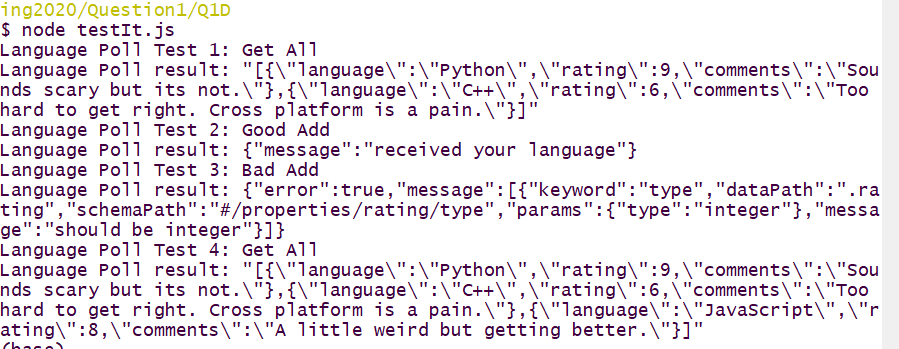

# Question 1 Programming Language Poll Server (20 pts)

You are starting work on the server side of an App for an online poll of *Programming Languages*. Note: there are **no** sessions or logins associated with this question.

You are provided with the following files:

* An `sampleData.json` This cannot be modified.

You will create **three** files:

* A JSON schema file for the input data as described in part (a)
* A server file also containing the API documentated in the comments per parts (b) and (c)
* A file to test the server per part (d)

## (a) JSON schema (5 pts)

The input to the server are JSON objects with the following fields and restrictions:

* Three *required* fields: *language*, *rating*, and *comments*
* *language* must be one of *Python*, *JavaScript*, or *C++*
* *rating* must be an integer between 1 and 10 inclusive.
* *comments* must be less than 250 characters.
* No additional fields are allowed in the JSON object.

Write a JSON schema to enforce the above requirements in a file named *dataSchema.json*.

## (b) API For getting, posting data to the server (2 pts)

Create a file for your server named *languageServer.js*. At the top of the file in comments describe the REST interface you will implement for users to get and add *language* polling data to the server. In particular you need an interface to get all the *languages* and to add a *language* to the server. You must specify *path* and *method* for each interface and the error code in case of bad input data.

## (c) Server Implementation (7 pts)

All data returned from the server will be in JSON format.

* Implement a server running on *localhost* at *port* 4051.
* Use the sample data provided to initialize an array of *languages* on the server.
* Implement the interface to retrieve all the *languages* (poll entries for the different languages, i.e., what is in the *languages* array on the server.)
* Implement the interface to add a *language* to the servers list of *languages*.
* Check all data submitted to the server against the JSON schema from part (a) return an appropriate error code if bad data is submitted.

## (d) Server Test (6 pts)

Write a program *testIt.js* to test the server you built above. Perform the following tests in *order*:

1. Get all the *languages* (polls) from the server
2. Add a valid *language* (poll) to the server
3. Try to add a invalid *language* (poll) to the server
4. Get all the *languages* (polls) again from the server (to see what did and didn't get added)

Make sure to produce resonable looking output from the test. A screenshot of my test output looks like:

