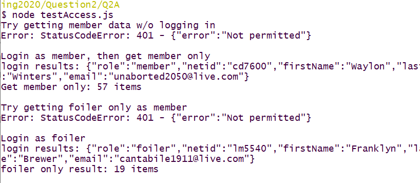

# Question 2 Controlled Access Server (20 pts)

You are starting work on for a company that serves up data to different types of users, i.e., implements role based access control.

You are provided with the following files:

* `siteUsers.json`: A file of user data including roles with passwords in the clear (for testing purposes only). You **cannot** modify.

* `secUsers.json`: A file of user data including roles with securely hashed (bcryptjs) passwords used by the server. You **cannot** modify. 

* `specialData1.json` and `specialData2.json` containing data for certain types of site users. These are used by the server. You will not be concerned with the details of these files. You **cannot** modify.

* `siteServer.js`: A functioning, session enabled, JSON API server, with *login* and *logout* functionality (via JSON). You **will** modify this file only in certain places as indicated in the *comments*.

In addition you will provide a file `testAccess.js` as indicated in part (d).

## (a) Change SID (2 pts)

In the file `siteServer.js` change the *session id* (cookie name) to match your netId.

## (b) Provide *member* only Access (4 pts)

In the `siteServer.js` file the variable `memberOnlyData` holds an array of data that is only for *members*. Write a new handler function that only allows users with the role *member* to get this data from the server. You should choose a reasonable path and method for this API as you will test this API in part (d).

## (c) Provide *foiler* only Access (4 pts)

In the `siteServer.js` file the variable `foilerOnlyData` holds an array of data that is only for *foilers*. Write a new handler function that only allows users with the role *foiler* to get this data from the server. You should choose a reasonable path and method for this API as you will test this API in part (d).

## (d) Test Interfaces (10 pts)

Write a test file `testAccess.js` to test the following items in order:

1. *member* only data **cannot** be accessed without logging in as a *member*.
2. *member* only data **can** be accessed by a user with the role *member*
3. A user with the role *member* **cannot** access data for users with the role *foiler*.
4. A user with the role *foiler* **can** access data for users with the role *foiler*

Your test script should produce reasonable output. You can demonstrate the reading of the different data sets by the item counts as shown in my example screen shot:

