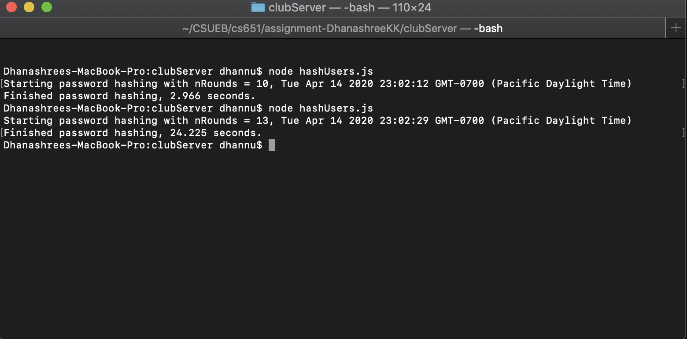
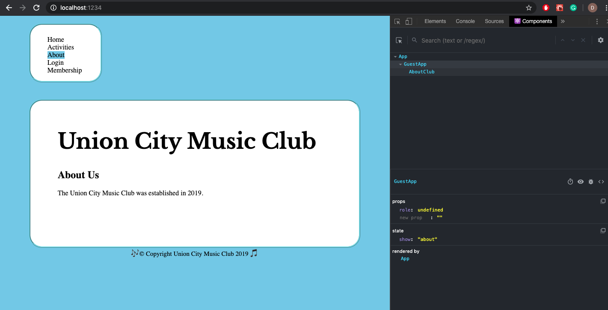
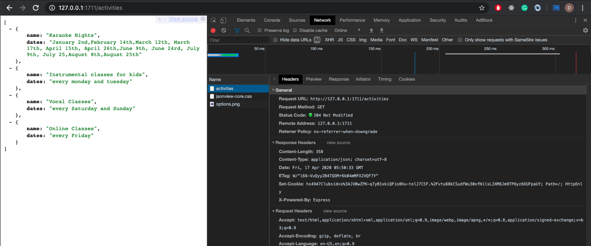
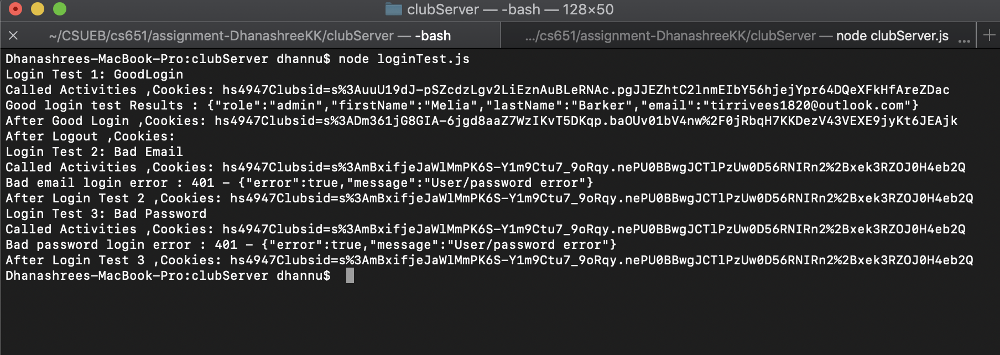

# Homework #6 Solution
**Student Name**:  Dhanashree Kamath Kasaragod

**NetID**: hs4947

## Question 1
### (a)

### (b)


### (c)
Guest App


Member App


Admin App


### (d)
As of now club main page is kept inside index.js along with state change code.
```index.js
import React from "react";
import ReactDOM from "react-dom";
import indexImg from "./clubimages/IndexImg.jpg";
import "./club.css";
import MemberApp from "./memberApp";
import AdminApp from "./adminApp";
import GuestApp from "./guestApp";


class App extends React.Component {
	constructor(props) {
		super(props);
        this.state = {role: "guest"}; // We will have "user" and "admin" roles too.
    }
    // Renders component based on current state and props
    render() {
    let contents = null;
        switch (this.state.role) {
            case "member":
                contents = <MemberApp role={this.state.member}/>;
                break;
            case "admin":
                contents = <AdminApp role={this.state.admin}/>;
                break;
            case "guest":
                contents = <GuestApp role={this.state.guest}/>;
                break;
            default:
                contents = <h2>Warning something went wrong!!!</h2>;
        }

    let mainPageBody = <div className ="divStyle">
	<main className ="box">
		<header>
			<h1 className="fh-custom-font"> Union City Music Club</h1>
			<h2> Introduction</h2>
		</header>
		<p>Union city music is the best destination for the music lovers to interact and perform.It provides ways for people to learn , mentor and play music. It is not only for professionals but also for hobbyists.Learn from expert teachers.</p>
		<figure>
			
			<figcaption>Music Club,Union City.</figcaption>
		</figure>
	</main>
	<footer>&#127926;&copy; Copyright Union City Music Club 2019 &#127925; </footer>
	</div>;

        return <div>
        {contents}
        {mainPageBody}
        </div>

   
    }
}
ReactDOM.render(<App />, document.getElementById("root"));
```

## Question 2 

### (a)


### (b)
``` guestApp.js
import React from "react";
import ReactDOM from "react-dom";
import HomeClub from "./Home";
import AboutClub from "./About";

class GuestApp extends React.Component {
	constructor(props) {
		super(props);
		this.state = {show: "home"}
	}
	homeHandler(event)
	{
		this.setState({show:"home"});
	}
	aboutHandler(event)
	{
		this.setState({show:"about"});
	}

	loginHandler(event)
	{
        this.setState({show:"login"});
	}
	activityHandler(event)
	{
		this.setState({show:"activities"});
	}
	membershipHandler(event)
	{
		this.setState({show:"membership"})
	}
   


 render(){ 
        let navBar =  <div>
	    <nav className="navbox">
		<ul className = "main-menu">
			<li className = {this.state.show == "home" ? "active" : null}><a onClick={this.homeHandler.bind(this)}>Home</a></li>
			<li className = {this.state.show == "activities" ? "active" : null}><a onClick={this.activityHandler.bind(this)}>Activities</a></li>
			<li className = {this.state.show == "about" ? "active" : null}><a onClick={this.aboutHandler.bind(this)}>About</a></li>
			<li className = {this.state.show == "login" ? "active" : null}><a onClick={this.loginHandler.bind(this)}>Login</a></li>
			<li className = {this.state.show == "membership" ? "active" : null}><a onClick={this.membershipHandler.bind(this)}>Membership</a></li>
		</ul>
	</nav>
	</div>;
	let contents = null;
	switch (this.state.show) {
            case "home":
                contents = <HomeClub role={this.state.home}/>;
                break;
            case "about":
                contents = <AboutClub role={this.state.about}/>;
                break;
            default:
                contents = <h2>Not implemented yet!!!</h2>;
        }
        return <div>{navBar}{contents}</div>
    }

}

export default GuestApp;
```
GuestApp home state



GuestApp about state



GuestApp login state



### (c)


## Question 3

### (a)   

Member State 



### (b)

Admin State


## Question 4

### (a)


### (c)


### (d)


## Question 5

### (a)

### (b)


