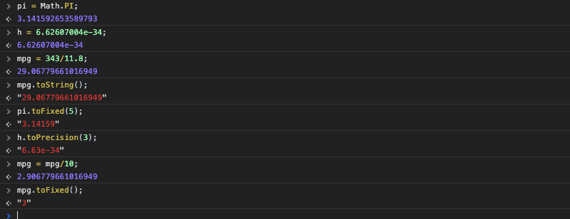
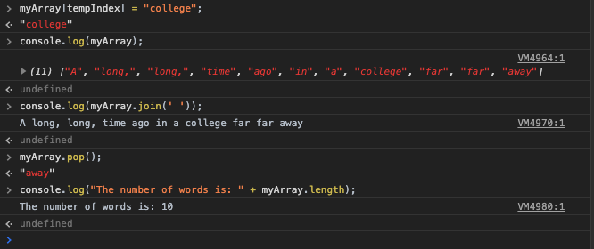
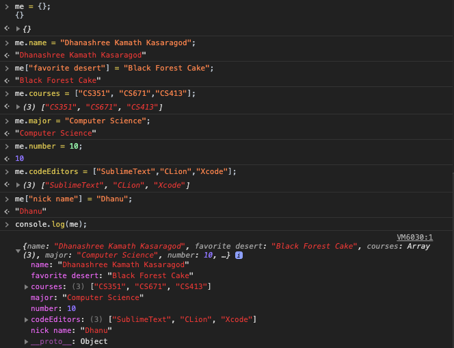
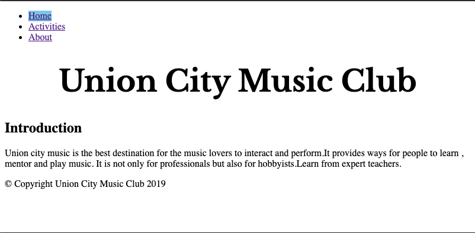
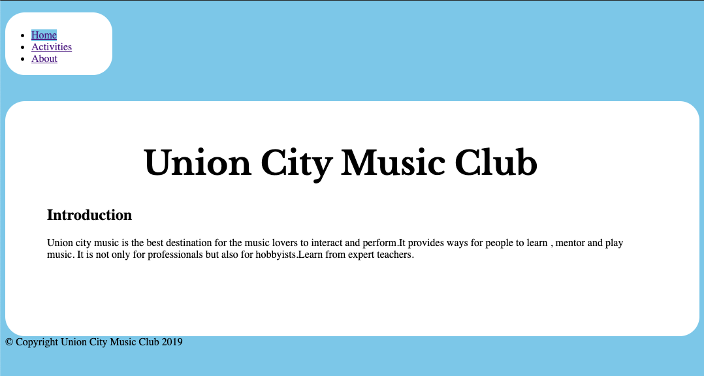
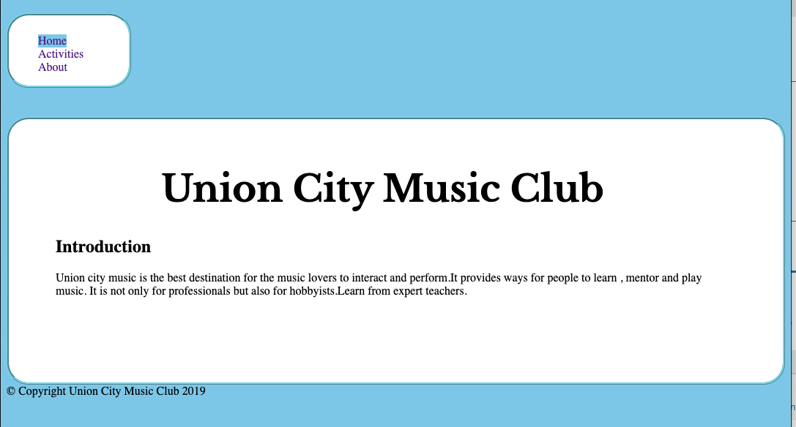
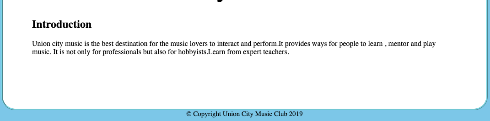

# Homework #2 Solution
**Student Name**:  Dhanashree Kamath Kasaragod

**NetID**: hs4947

## Question 1
### (a)
#### tags
1. `<nav></nav>`
2. `<a></a>`
3. ``
#### attributes
1. `class="navbar navbar-expand-sm navbar-dark bg-dark sticky-top"`
2. `class="navbar-brand d-none d-md-block"`
3. `href="#"`
4. `alt="Grotto Networking" `
5. `src="/images/sideLogo.png" `
6. `style="width: 150px"`

### (b)
An element can have only one (or no) id and it must be unique within the HTML document. id attributes as targets for links is one of the factors that contributes to it needing to be unique. There are also other factors like style linking using CSS and javascript linking.

We can use the same class on multiple elements in a document.This is helpful when we need to style two different element in same way.We can reuse the existing class instead of writing new one.

### (c)
1)
```
body {
  padding-bottom: 50px;
}
```
 
- selector - basic
- type - type selector
- properties - padding-bottom
- value - 50px

2)
```
#RelatedItems {
  max-height: 50vh;
  overflow-y: auto;
}
```
- selector - basic
- type - ID selector
- properties
  - overflow-y
  - max-height
- value
  - 50vh
  - auto
3)
```
.graphDrawing {
  border: dashed thin #808080;
  border-radius: 5px;
  width: 90%;
  margin: 0;
  margin-bottom: 25px;
}
```

- selector - basic
- type - class selector
- properties
  - border
  - border-radius
  - width
  - margin
  - margin-bottom
- value 
  - dashes thin #808080
  - 5px
  - 90%
  - 0
  - 25px

### (d)

article figcaption - It is a descendant selector, all the figcaption element under article tag will take the properties such as "font-size" and "text-align".

a.navbar-brand img - This is also descendant selector but the properties described under "a.navbar-brand img" will be applied only to the img element under tag a containing class name navbar-brand.


## Question 2
### (a)


### (b)
(i)  The `<main>` of a document must include unique content. Navigation links may appear multiple times in a document. It is not a best practice to use it inside `<main>`, but it is possible to put a site wide navigation inside it if the document or application's `<main>` is of search form.

(ii) banner is possible to put inside `<main>` if its relevant to the `<main>` content. It is better to use `<header>` as banner ensuring that it is not a descendant of any subsection of the page. 

(iii) Best practice to put copyright information is outside `<main>`. It is possible to put copyright notices in the `<main>` element, but it is not a good practice.

List of files:
- index.html
- about.html
- activities.html


### (c)

According to the [HTML5.2 Spec-header](https://www.w3.org/TR/2017/REC-html52-20171214/sections.html#the-header-element) `<header>` represents the introductory content for the nearest `<main>`. If the `<header>` contains generic elements then it will remain outside `<main>`. Sometimes we can see header inside `<main>` if it contains relevant heading and in-page navigation.

### (d)

According to the [HTML5.2 Spec-footer](https://www.w3.org/TR/2017/REC-html52-20171214/sections.html#the-footer-element) `<footer>` contains information about who wrote it, links and copyright, etc. One of the reasons it is at the bottom of the body tag, is so that assistive technogolies can provide information on the type of the content. It is also easy to represent author information. If the `<footer> `content is relevant to the `<main>` content.

### (e)

  

### (f)

#### HTML code of the index.html page
```
<!DOCTYPE html>
<html lang="en"> <!-- English -->
<head>
  <title>Home Page</title>
  <link rel="stylesheet" href="styles.css">
</head>
<!-- I'm an HTML comment -->
<body> <!-- Nothing here yet. -->
  <nav>
    <ul>
      <li class="active"><a href="index.html">Home</a></li>
      <li><a href="activities.html">Activities</a></li>
      <li><a href="about.html">About</a></li>
    </ul>
  </nav>
  <main>
   <header>
      <h1> Union City Music Club</h1>
      <h2> Introduction</h2>
    </header>
    <p>Union city music is the best destination for the music lovers to interact and perform.It provides ways for people to learn , mentor and play music. It is not only for professionals but also for hobbyists.Learn from expert teachers.</p>
  </main>

  <footer>&copy; Copyright Union City Music Club 2019 </footer>
</body>
</html>
```
## Question 3
### (a)
(i) `parseInt('hello');`- If the first character cannot be converted to a number it will return NaN. NaN is not a number.\
(ii)`parseInt('12hello');`- It parsed string and returned  12.\
(iii)`parseInt('1010',2);`- number in the string is parsed from binary(radix =2) to a decimal number and returns answer as 10.\
(iv)`parseInt('hi5');`-It is not same as (ii) the answer for this is NaN. It is because first character couldn't be converted as integer.\
(v)`parseFloat(3.145Dhanashree);`- 3.145\
(vi)`parseFloat(Dhanashree2112);`- NaN

 

### (b)
 


### (c)

Two string delimiters are there .This is because we can use single quote, if double quotes need to be appear inside the string without having to escape them or vice versa.

(i)
```
test = "It's a pain to always escape quotes";
console.log(test);
```
This code snippet works.

(ii)
```
test2 = 'It's a pain to always escape quotes'; 
console.log(test2);
```
javascript interpret 'It's as the end of the string.

(iii)
```
test3 = 'It\'s a pain to always escape quotes'; 
console.log(test3);
```
backslash ( \ ) character is used to prevent javascript from interpreting a quote 'It\'s as the end of the string.

 

### (d)
(i)
```
name = "Dhanashree Kamath Kasaragod"
uname = name.toUpperCase(); 
console.log(uname);
```
This will convert the given name to uppercase letters. uname = "DHANASHREE KAMATH KASARAGOD".

(ii)
```
lname = name.toLowerCase(); // (ii) What?
console.log(lname);
```
This will convert the given name in to lower case letter. lname = "dhanashree kamath kasaragod".

(iii)
```
console.log("Your name includes an 'a': " + uname.includes('A'));
console.log("Your name includes an 'i': " + lname.includes('i'));
```
include function will determine a string contains specified character 'A' and 'i' in the uname and lname.

 

### (e)

 

## Question 4
### (a)
(i)
```
sentence = "A long, long, time ago in a galaxy"; // A string
myArray = sentence.split(' '); // (i) what does this do?
console.log("The number of words is: " + myArray.length);
```
The split() method split given string into an array of substring and returns new array.

(ii)
```
myArray.push("far"); // (ii) what do each of these calls do?
myArray.push("far");
myArray.push("away");
console.log("The number of words is: " + myArray.length);
```
The push() metgod will add specified element (ex:far,far,away) in to the end of an array and returns the new length of the array.

(iii)
`console.log(myArray.join('_'));`

The join() method will concatenate all the elements of the array with specified seperator in between an array element.In the abobe example unserscore is the seperator.
ex: ` A_long,_long,_time_ago_in_a_galaxy_far_far_away`

(iv)
`tempIndex = myArray.indexOf('galaxy');`

The indexOf('galaxy') method will return the index/position of the 'galaxy' string in the myarray.

(v)
`myArray[tempIndex] = "college"; `
In the above statement element of my array of the specified index is changed to string "college".

before changing myarray: ["A", "long,", "long,", "time", "ago", "in", "a", "galaxy"] \
after changing myarray: ["A", "long,", "long,", "time", "ago", "in", "a", "college", "far", "far", "away"]

(vi)
```
myArray.pop(); // (vi) what does this do?
console.log("The number of words is: " + myArray.length);
```
pop() removes last element from an array and returns that element and changes the length of the array.

 

### (b)

(i)
```
function upper(xString) { // (i) What does this function do?
  return xString.toUpperCase();
}
```
The upper function will convert the input string in to the uppercase string.

(ii)
`myArray3 = myArray2.map(upper);`

map() method creates new array and add the results of calling a provided function on every element in the calling array.

(iii) 
`if (x.toLowerCase() < y.toLowerCase()) { // (iii) why would I do this?
    return -1;
  }`

compare function is written above to sort an array elements in a specific order. If it is not specfied, array elements are sorted by converting them to strings and then sorting according to UTF-16 code unit order.

(iv)
`myArray2.sort(noCaseSort);`
sort() method here  will  sort  the array elements in place  by calling "nocasefunction" and returns sorted array. 

### (c)
(i)
 me["favorite desert"] syntax is used because it is not a valid identifier in javascript. That means there is a space between the proprty name in such case it can be only be accesed using square bracket notation.

(ii)
`me.courses = ["CS351", "Your other courses"];
`
We can put array in an object.

(iii)
`me.number = 10`;

(iv)
`me.codeEditors = ["Sublime Text++", "CLion", "Xcode"];`

 

## Question 5
### (a)
 

### (b)
 

### (c)
selector used in styling <nav>
```
li.active{
  background-color: #87ceeb;
  display: inline-block; 
}
li a:hover{
  background-color: #87a7eb;
}

.main-menu{
  
  list-style: none; //list 
}
.main-menu a{
  
  text-decoration: none; // anchor 
}
```
 

### (d)

 


