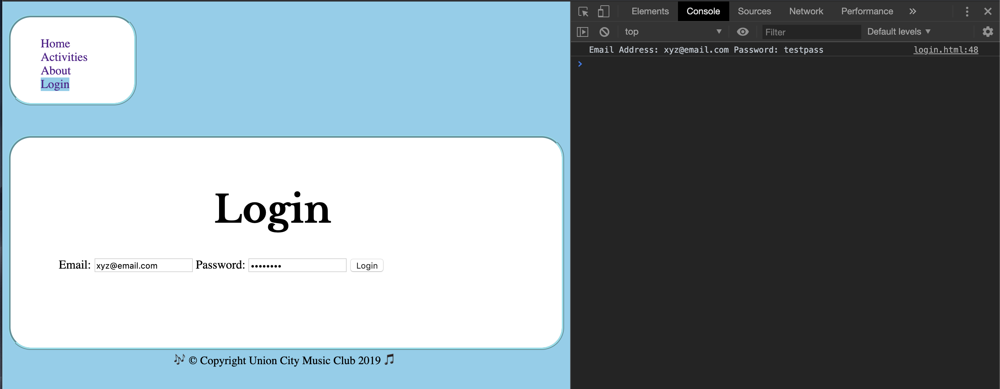
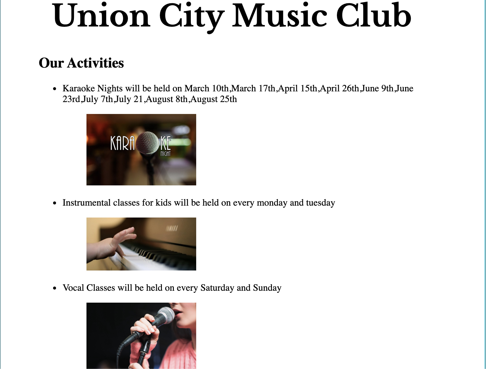
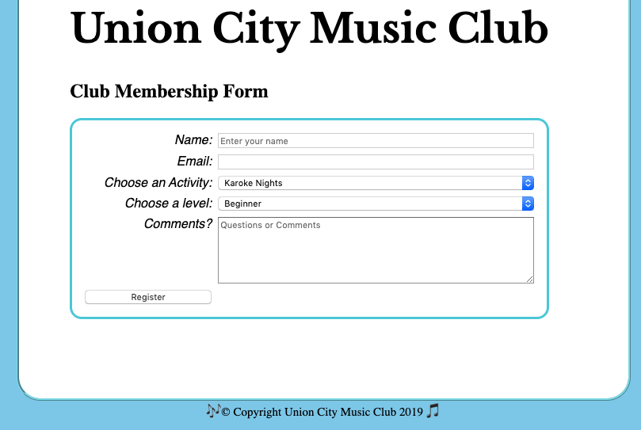
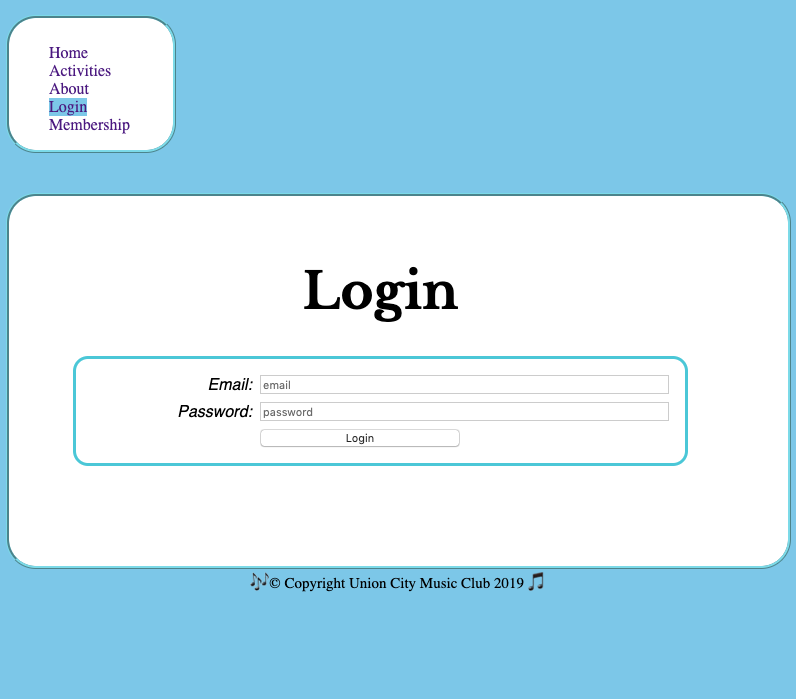
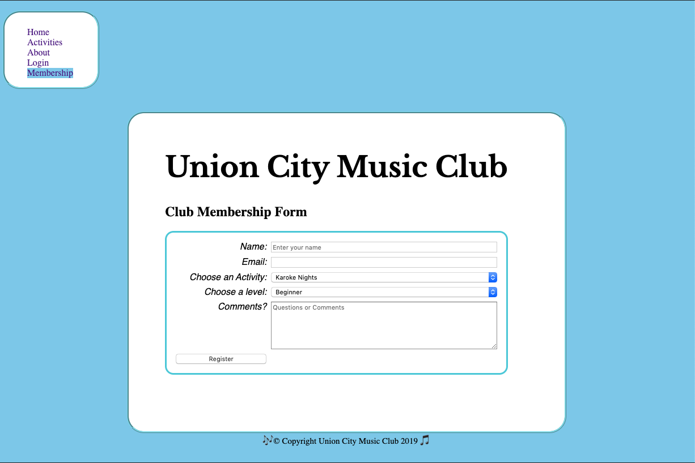

# Homework #4 Solution
**Student Name**:  Dhanashree Kamath Kasaragod

**NetID**: hs4947

## Question 1
### (a)


### (b)
``` javascript
<script>
        //document.querySelector("button").onclick = function(event) { 
            var loginButton = document.getElementById("loginBtn");
            loginButton.addEventListener("click",onClickOfLoginBtn);
            function onClickOfLoginBtn()
            {
            var userEmail = document.getElementById("email").value;
            var password = document.getElementById("password").value;     

            var userInfo = "Email Address: " + userEmail +" Password: "+password;
            console.log(userInfo);
        }
    </script>
```



## Question 2 

### (a)
```javascript
// Union City Music Club Year 2020 events
events = [{"name": "Karaoke Nights",
           "dates": ["January 2nd","February 14th","March 12th", "March 17th", "April 15th", "April 26th",
                     "June 9th", "June 24rd", "July 9th", "July 25",
                     "August 8th", "August 25th"],
           "image":"clubimages/KaraokeImg.jpg"},
         {"name": "Instrumental classes for kids",
          "dates": ["every monday and tuesday"],
          "image":"clubimages/KidInstrument.jpg"},
         {"name": "Vocal Classes", 
         "dates": ["every Saturday and Sunday"],
          "image":"clubimages/VocalImage.jpg"},
          {"name": "Online Classes", 
         "dates": ["every Friday"],
          "image":"clubimages/OnlineImg.jpg"}];

```

### (b)


### (c)

script on activities.js
```javascript
//Adding events to the activity page
function addEvents(argument) {
    events.map(item => addLi(item,"clubEvents"));
}
function addLi(events, className) {
    var liChild = document.createElement("li");

    var figChild = document.createElement("figure");
    var imgChild = document.createElement("img");
    imgChild.src = events.image;
    imgChild.classList.add("activityImage");
    var childInfo = document.createTextNode(events.name+" will be held on "+events.dates);
    figChild.appendChild(imgChild);
    liChild.appendChild(childInfo);
    liChild.appendChild(figChild);
    document.getElementsByClassName(className)[0].appendChild(liChild);
}
window.onload = function() {
    addEvents();
};
```


## Question 3

### (a)   
```html
<section id= "membershipForm">
            <label for="name">Name:</label>
            <input type="text" id="name" name="name" placeholder ="Enter your name">
            <label for="email">Email:</label>
            <input type="email" id="email" name="email">

            <label for="actType">Choose an Activity:</label>
            <select id="activityType">
                <option value="karokeNights">Karoke Nights</option>
                <option value="instrument">Instrumental</option>
                <option value="vocal">Vocal</option>
                <option value="online">Online</option>
            </select>

            <label for="level">Choose a level:</label>
            <select id="activityLevel">
                <option value="beginner">Beginner</option>
                <option value="intermediate1">Intermediate1</option>
                <option value="intermediate2">Intermediate2</option>
                <option value="advanced">Advanced</option>
            </select>
            <label for="comments">Comments?</label>
            <textarea id="questionComments" cols="30" rows="6" placeholder="Questions or Comments"></textarea>
            <button type="button" id = "register">Register</button>
        </section>  
```
                  


### (b)


### (c)


### (d)

````javascript
function getRegisterBtn()
{
   var registerButton = document.getElementById("register");
   registerButton.addEventListener("click",onClickOfRegisterBtn);
   
}

function onClickOfRegisterBtn()
{
    // var x = document.getElementById("dialogBox");
    // x.show();
    let thanksDialog = document.getElementById("ThanksDialog");
    thanksDialog.classList.add("ShowDialog");
    thanksDialog.style.display="block";
    let h2Child = document.createElement("h2");
    let parChild = document.createElement("p");
    let closeBtn = document.createElement("button");
    closeBtn.id = "closeBtn"
  
    thanksDialog.appendChild(h2Child);
    thanksDialog.appendChild(parChild);
    thanksDialog.appendChild(closeBtn);
    
    var name = document.getElementById("name").value;
    var email = document.getElementById("email").value; 
    var activityType = document.getElementById("activityType").value;
    var activityLevel = document.getElementById("activityLevel").value; 
    var questionComments = document.getElementById("questionComments").value;  


    var userInfo = "Name: " + name +"  Email Address:" + email +"  ActivityType: "+ activityType +"  ActivityLevel: "+ activityLevel+ "  Questions and comments:" + questionComments;
    console.log(userInfo);
    h2Child.innerHTML = "Thanks for Registering!!!!";
    parChild.innerHTML = userInfo;
    closeBtn.innerHTML = "Close";

    var closeButton = document.getElementById("closeBtn");
    closeButton.addEventListener("click",onClickOfCloseBtn);
    let modalSection = document.getElementById("modal");
    modalSection.style.display = "block"
}

function onClickOfCloseBtn()
{
    var dialogSec = document.getElementById("ThanksDialog");
    dialogSec.classList.remove("ShowDialog");
    dialogSec.style.display = "none";
    dialogSec.innerHTML = " "
    let modalSection = document.getElementById("modal");
    modalSection.style.display = "none"


}
window.onload = function() {
    getRegisterBtn();
};
````
## Question 4

### (a)


```css
#membershipForm {
    display: grid;
    grid-template-columns: 10em 1fr;
    grid-row-gap: 0.5em;
    grid-column-gap:0.5em;
    padding: 1em;
    border: solid #55cedc;
    border-radius: 15px;
  }
#membershipForm label {
  justify-self: end;
  font-family: sans-serif;
   font-style: italic;
}

```

### (b)
``` css
#modal {
        display: none; 
        position: fixed; 
        z-index: 1; 
        padding-top: 100px; 
        left: 0;
        top: 0;
        width: 100%;
        height: 100%;
        overflow: auto;
        background-color: RGBA(0,0,0,0.7); /* Fallback color */
    }

    .ShowDialog {
        background-color: White;
        margin: auto;
        padding: 20px;
        border: 1px solid #888;
        width: 80%;
        
    }
```

### (c)


``` css
#loginForm
    {
        display: grid;
        grid-template-columns: 10em 1fr;
        grid-row-gap: 0.5em;
        grid-column-gap:0.5em;
        padding: 1em;
        border: solid #55cedc;
        border-radius: 15px;
        max-width: 50;
        align-items: center;
    }

    #loginForm label{
        justify-self: end;
        font-family: sans-serif;
        font-style: italic;
    }
    
     #loginBtn{
        grid-column-start: 2;
        max-width: 200px;
        
    }
```

### (d)


```css
.navbox{
    background-color: white;
    padding-top:10px;
    padding-right: 4em;
    margin-top: 10px;
    border-radius: 30px;
    max-width: 100px;
    border-style: ridge;
    border-color: #87dfeb;
    margin-right: auto;
}

body {
    display:flex;
    flex-direction: column;
    justify-content: space-around;
    align-items: center;
}

.box {
    padding-top:30px;
    padding-right: 100px;
    padding-bottom: 100px;
    padding-left: 4em;
    background-color: white;
    margin-top: 40px;
    border-radius: 30px;
    border-style: ridge;
    border-color: #87dfeb;
}

footer {
    text-align: center;
    font-size: 15px;
    max-width: 50px
    max-height:50px;
}

```

## Question 5

[ClubProject URL](http://csweb01.csueastbay.edu/~hs4947/clubProject/index.html)
