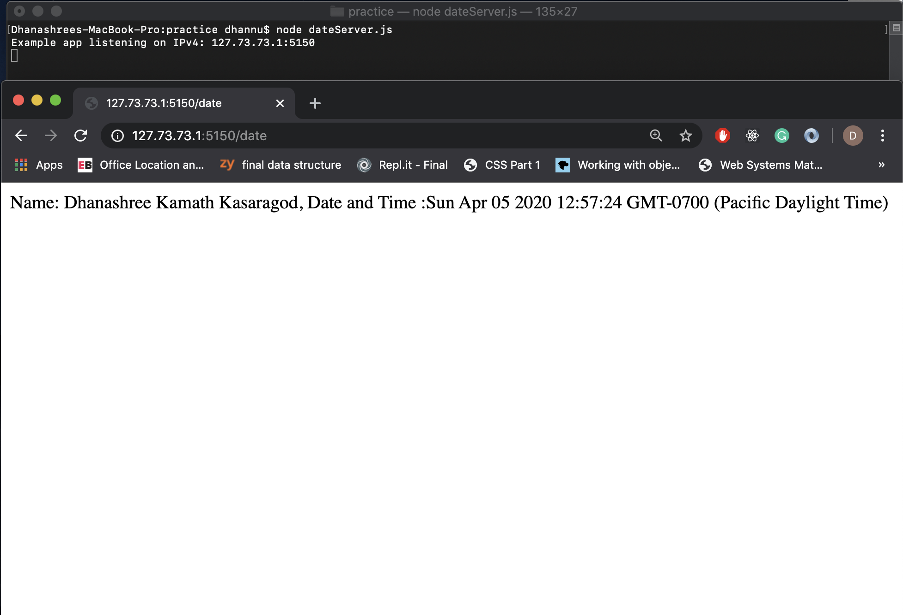
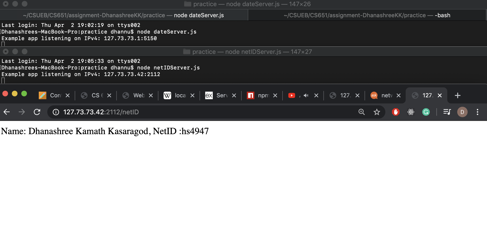
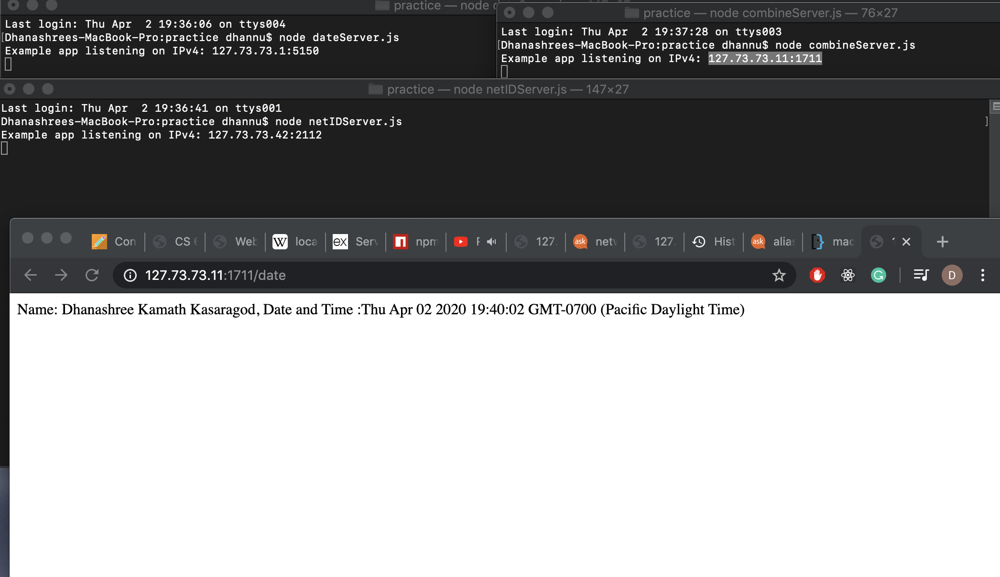
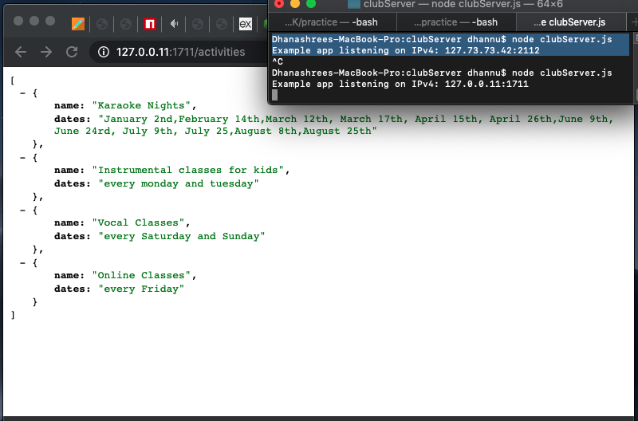
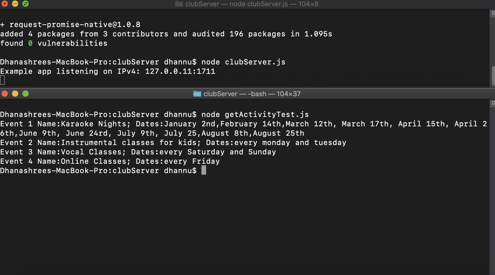
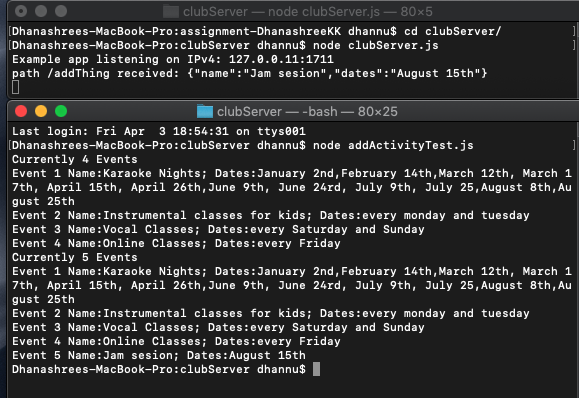
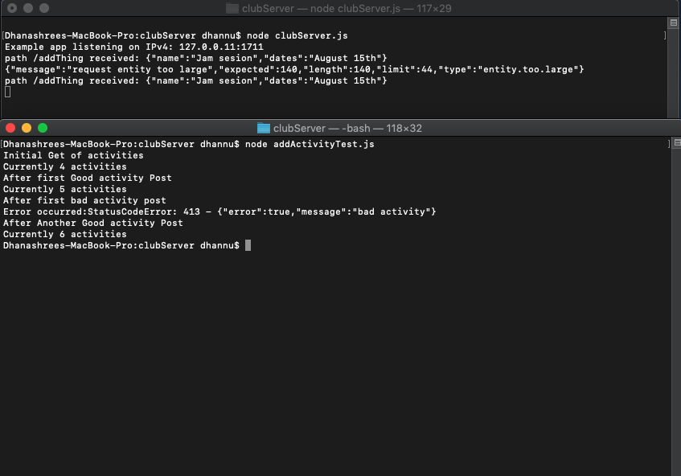
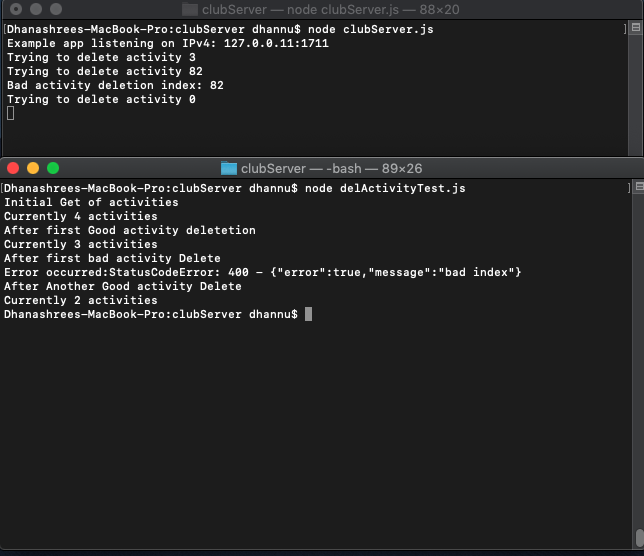

# Homework #8 Solution
**Student Name**:  Dhanashree Kamath Kasaragod

**NetID**: hs4947

## Question 1
### (a)
* GET HTTP method is used in the request

* HTTP response status code indicate whether a specific HTTP request has been successfully completed. For example: 200 OK (Successful response)

* HTTP version used HTTP/1.1

### (b)
List the request headers and their values here (copy and paste)
```HTTP
GET / HTTP/1.1
Host: bb.csueastbay.edu
Connection: keep-alive
Cache-Control: max-age=0
Upgrade-Insecure-Requests: 1
User-Agent: Mozilla/5.0 (Macintosh; Intel Mac OS X 10_14_6) AppleWebKit/537.36 (KHTML, like Gecko) Chrome/80.0.3987.149 Safari/537.36
Sec-Fetch-Dest: document
Accept: text/html,application/xhtml+xml,application/xml;q=0.9,image/webp,image/apng,*/*;q=0.8,application/signed-exchange;v=b3;q=0.9
Sec-Fetch-Site: none
Sec-Fetch-Mode: navigate
Sec-Fetch-User: ?1
Accept-Encoding: gzip, deflate, br
Accept-Language: en-US,en;q=0.9
Cookie: _ga=GA1.2.1475441467.1582606494; __utmc=208548673; __utmz=208548673.1584980877.72.13.utmcsr=google|utmccn=(organic)|utmcmd=organic|utmctr=(not%20provided); wl_auth=client_id=00000000481AF445&status=unchecked; AWSELB=D3570BC914533D9ACC5FBEA2A258730F699E691A0ABC1ED62EDAD5455CC53097809BAEF278DDBFB83587B538B0F877AE04C46F9E789B3AC2D2E04D2483546BB148F69A866F; AWSELBCORS=D3570BC914533D9ACC5FBEA2A258730F699E691A0ABC1ED62EDAD5455CC53097809BAEF278DDBFB83587B538B0F877AE04C46F9E789B3AC2D2E04D2483546BB148F69A866F; __utma=208548673.1205622182.1582597512.1586051361.1586111680.95; __utmt=1; __utmb=208548673.4.10.1586111680; JSESSIONID=B315F5A6B3027F676184D00C9C5BA27C; BbRouter=expires:1586114235,id:4A08CE40AF44591E62F374FDEE9AA1AD,signature:bc3c2389a715228c3eb35b3a399397d57dadcce0c0e226305096f75eee82e57d,site:aefdf5db-8c6a-4e8e-8bf7-fb9f1f4dcdf0,v:2,xsrf:6d7783b7-0629-4249-8ff5-eb008e797da7
```

### (c)
List the response headers and their values here (copy and paste)
``` HTTP
HTTP/1.1 200
Cache-Control: private
Cache-Control: max-age=0
Cache-Control: no-store
Cache-Control: must-revalidate
Content-Encoding: gzip
Content-Language: en-US
Content-Security-Policy: frame-ancestors 'self'
Content-Type: text/html;charset=UTF-8
Date: Sun, 05 Apr 2020 18:47:17 GMT
Expires: Fri, 05 Apr 2019 18:47:17 GMT
Last-Modified: Wed, 05 Apr 2000 18:47:17 GMT
P3P: CP="CAO PSA OUR"
Pragma: private
Server: openresty/1.9.3.1
Set-Cookie: BbRouter=expires:1586114237,id:4A08CE40AF44591E62F374FDEE9AA1AD,signature:f981fb7a95ec52cabe22f8a611a097a06cf56e8ced09f7055523d28da5941ce0,site:aefdf5db-8c6a-4e8e-8bf7-fb9f1f4dcdf0,v:2,xsrf:6d7783b7-0629-4249-8ff5-eb008e797da7; Path=/; Secure; HttpOnly
vary: accept-encoding
X-Blackboard-appserver: ip-10-145-95-241.ec2.internal
X-Blackboard-product: Blackboard Learn &#8482; 3800.6.0-rel.15+a3bf299
X-Frame-Options: SAMEORIGIN
Content-Length: 18455
Connection: keep-alive
```

### (d)

Server: openresty/1.9.3.1

yes,
Set-Cookie: BbRouter=expires:1586113700,id:4A08CE40AF44591E62F374FDEE9AA1AD,signature:d69f8ee0a365a7ed629389be6c582c72d1a0e8543ca8f2805207e7a854b9ff12,site:aefdf5db-8c6a-4e8e-8bf7-fb9f1f4dcdf0,v:2,xsrf:6d7783b7-0629-4249-8ff5-eb008e797da7; Path=/; Secure; HttpOnly


### (e)
protocol : https, http  
domain : developer.mozilla.org, www.google.com,  
port :8282  
path : static/index.html, en-US/docs/Web/JavaScript/Guide/Grammar_and_Types, /search  
query : ?q=gaia+mission&rlz=1CYPO_enUS751  
fragment : #Comments  

## Question 2 

### (a)


### (b)


### (c)

``` combineServer.js
const express = require('express');
const app = express();

app.get('/date', function (req, res) {
    
   let name = "Dhanashree Kamath Kasaragod";
    	let datetime = new Date();

    res.send(`Name: ${name}, 
        Date and Time :${datetime}`);
});

app.get('/netID', function (req, res) {
    
   let name = "Dhanashree Kamath Kasaragod";
   let netID = "hs4947";

    res.send(`Name: ${name}, 
        NetID :${netID}`);
});

host = '127.73.73.11';
port = '1711';
app.listen(port, host, function () {
console.log(`Example app listening on IPv4: ${host}:${port}`);
});
```

## Question 3

### (a)   
```clubServer.js
const express = require('express');
const app = express();

app.get('/activities', function (req, res) {
    
    let activityJson = require('./activities.json');

    //res.send(`${JSON.stringify(activityJson)}`);
    res.json(activityJson);
});


host = '127.0.0.11';
port = '1711';
app.listen(port, host, function () {
console.log(`Example app listening on IPv4: ${host}:${port}`);
});

```


### (b)


```getActivityTest.js
const rp = require('request-promise-native');
let site = {
    uri: 'http://127.0.0.11:1711/activities',
    method: 'GET', // What does this do?
    resolveWithFullResponse: false
};
rp(site).then(res => {
	let a = JSON.parse(res)
	let count = 1
	a.map(b => {
		console.log("Event "+count+" Name:"+b.name+"; Dates:"+b.dates);
		count++;
	})
})
```
## Question 4

### (a)
code of newly added interface 
```clubServer.js
app.post('/activities', express.json(), function(req, res) {
   activityJson.push(req.body)
   console.log(`path /addThing received: ${JSON.stringify(req.body)}`);
   res.json(activityJson)

});
```
### (b)
```addActivityTest.js
const rp = require('request-promise-native');

let getCall = {
    url: 'http://127.0.0.11:1711/activities',
    method: 'GET', // What does this do?
    resolveWithFullResponse: false
};


let postCall = {
    url: 'http://127.0.0.11:1711/activities',
    method: 'POST', // What does this do?
    json: true,
    body: {
      name: "Jam sesion",
      dates: "August 15th"
  }
};

rp(getCall).then(res => {
  let parsedJsonactivity = JSON.parse(res)
  console.log("Currently "+parsedJsonactivity.length+" activities");
  let count = 1
  parsedJsonactivity.map(activity => {
    console.log("activity "+count+" Name:"+activity.name+"; Dates:"+activity.dates);
    count++;
  })
  return rp(postCall)
}).then(res => {
console.log("Currently "+res.length+" activities");
let count = 1;
 res.map(activity => {
    console.log("activity "+count+" Name:"+activity.name+"; Dates:"+activity.dates);
    count++;
  })
})
```


### (c)
updated function to handle errors
```clubServer.js 
app.use(function activityErrors(err, req, res, next) {
    // prepare and send error response here, i.e.,
    // set an error code and send JSON message
    res.status(413).send(errorResponse)
    console.log(JSON.stringify(err));
    return;
  })

```

### (d)


``` addActivityTest.js
 rp(getCall).then(res => {
  console.log("Initial Get of activities");
  let parsedJsonactivity = JSON.parse(res)
  printActivities(parsedJsonactivity);
  return rp(postCall)
}).then(res => {
  console.log("After first Good activity Post")
  printActivities(res);
  return rp(postFailureCall)
}).catch(function(err){
  console.log("After first bad activity post");
  console.log("Error occurred:"+err);
  return rp(postCall)
}).then(res =>{
  console.log("After Another Good activity Post")
  printActivities(res);
})
```
## Question 5

### (a)

code after delete interface
``` codeServer.js
let errorResponse2 = {"error": true, "message":"bad index"}


app.delete('/activities/:i', function(req, res) {

 let id = req.params.i
 console.log("Trying to delete activity "+ id)
 if (id <0 ||id >= activityJson.length) {
   console.log("Bad activity deletion index: "+ id)
   //res.status(400).send(errorResponse2);
   next();
 } else {
  activityJson.splice(id, 1)
  res.json(activityJson)
}

});

app.use(function deleteErrorHandling(err, req, res, next) {
  if(req.route.methods.delete == true){
    res.status(400).json(errorResponse2);
  } else {
    next(err)
  }

})

```
### (b)



