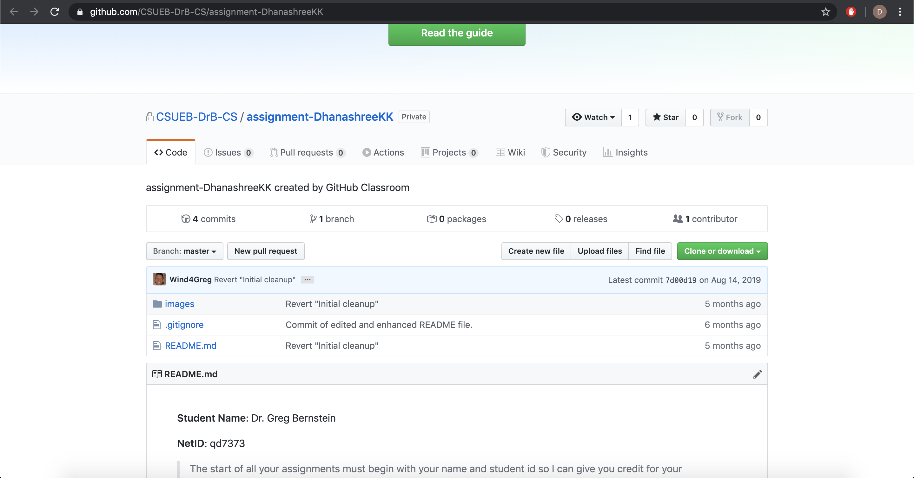
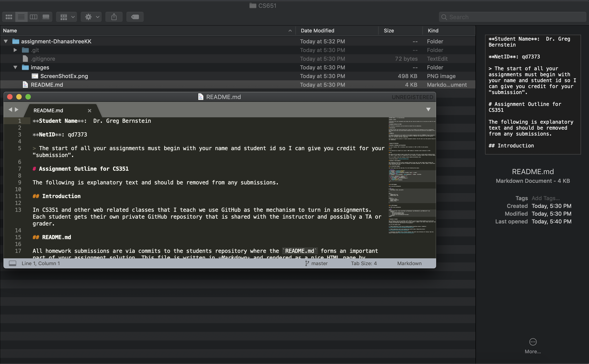
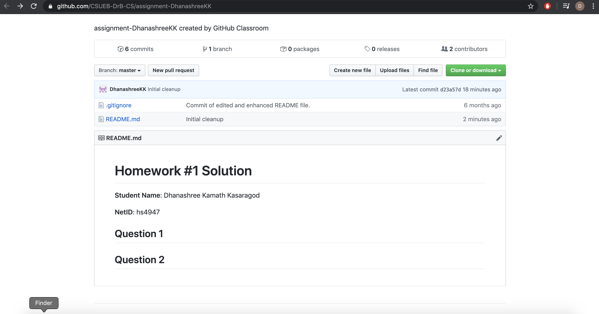

# Homework #1 Solution
**Student Name**:  Dhanashree Kamath Kasaragod

**NetID**: hs4947

## Question 1
### (a)

### (b)



## Question 2
### (a)


### (b)

### (c)


## Question 3
### (a)


### (b)


## Question 4
### (a)
1. C++
2. Java
3. Python

### (b)
* Mac OS
* Windows
* Linux

### (c)
* CLion
* XCode
* Intellij
* Sublime Text

## Question 5
### (a)
``` C++ Sample code
#include <iostream>
using namespace std;

int main() {

    int number = 10;
    int sum = 0;
    int average = 0;
    cout << "Print First 10 numbers and its average :\n";
    for (int i=0;i<number;i++)
    {
       sum = sum + i;
    }
    average = sum/2;
    cout << "Sum =%d"<< sum;
    cout << "Average = %d"<< average;
    return 0;
}
```
### (b)
CLion - It is a cross platform IDE for C and C++. This IDE add class members, override/implement functions, generate constructors/destructors, refactor code,etc. via simple keyboard shortcuts: [CLion](https://www.jetbrains.com/clion/)

Git - It is a free and open source distributed version control system designed to handle everything all types of projects with speed and efficiency. It is convenient for multiple workflows: [Git](https://git-scm.com/)


