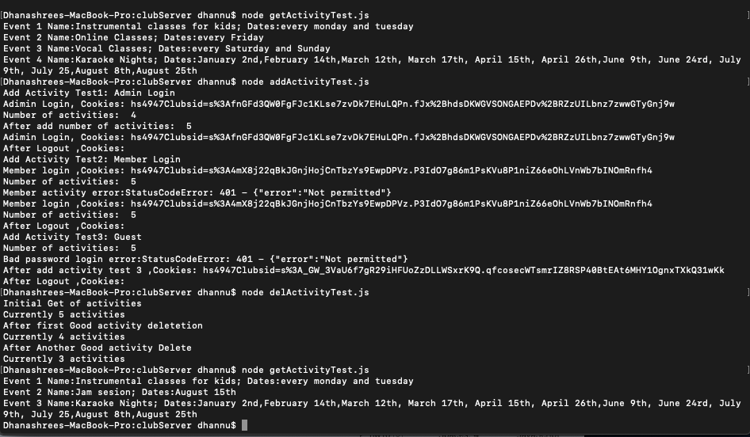
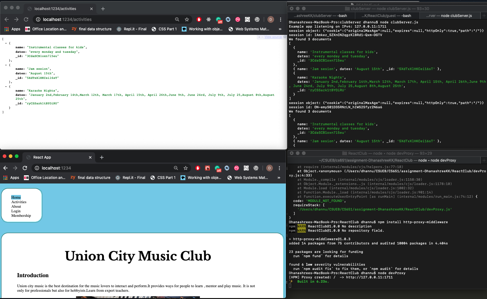
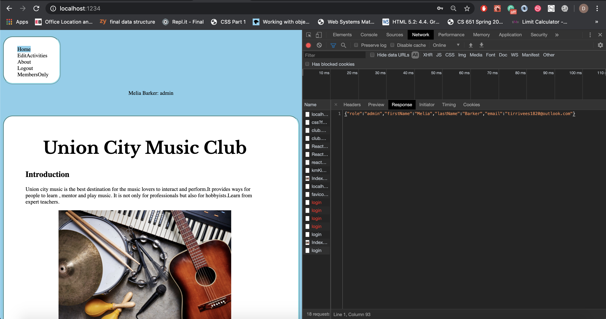
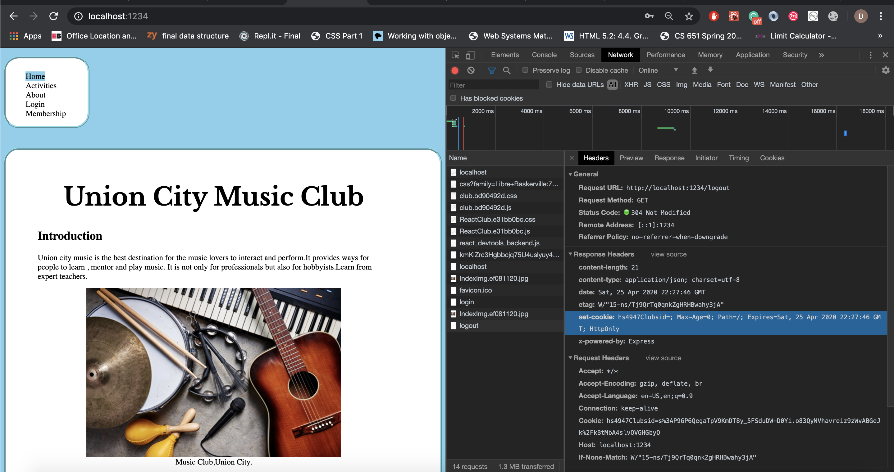
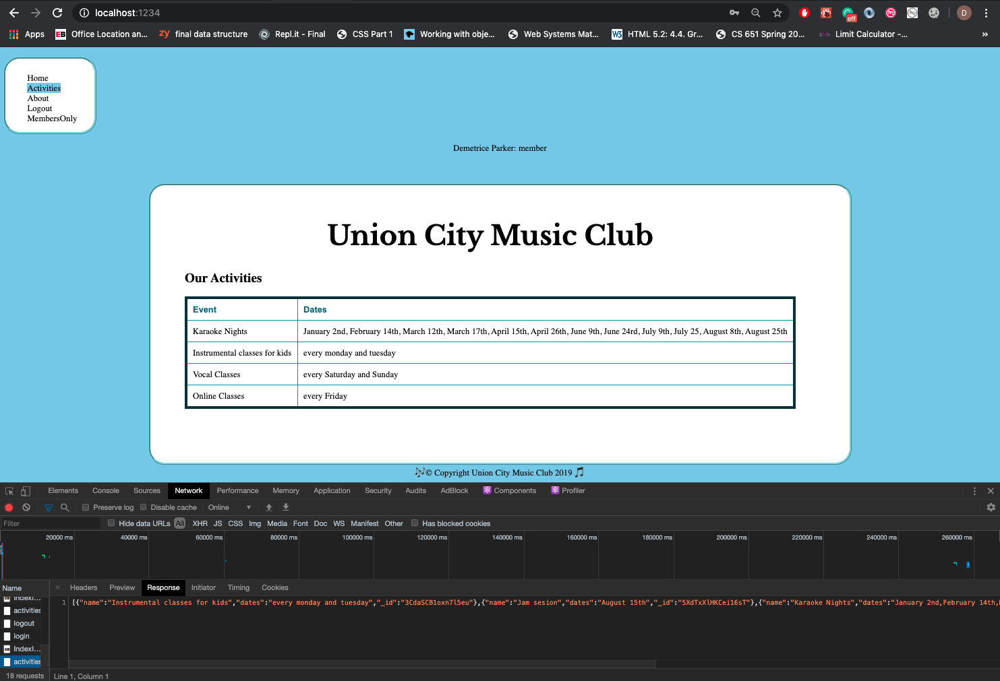

# Homework #8 Solution
**Student Name**:  Dhanashree Kamath Kasaragod

**NetID**: hs4947

## Question 1
### (a)
1.
path : http://127.0.0.11:1711/activities
method: GET
sucess code: by default 200 (OK)
failure code: 404 (not found)
role: guest, member, admin

2.
path : http://127.0.0.11:1711/activities
method: POST
sucess code: by default 200 (OK)
failure code: 413(Request entity too large)
role: Only admin can add the activities

3.
path :http://127.0.0.11:1711/activities/:id
method: DELETE
sucess code: 200(OK)
failure code: 400 (BAD request response)
role:Only admin can delete the activities

4.
path : http://127.0.0.11:1711/users
method: GET
sucess code: 200(OK)
failure code: 413
role: only admin can get the number of users

### (b)
Deleting activity permission should only be given to admin. This resrtiction was not implemneted before.
Adding checkAdmin middilewear
``` clubServer.js
app.delete('/activities/:i',checkAdminMiddleware, function(req, res) {

 let id = req.params.i
 console.log("Trying to delete activity "+ id)
 if (id <0 ||id >= activityJson.length) {
   console.log("Bad activity deletion index: "+ id)
   //res.status(400).send(errorResponse2);
   next();
 } else {
  activityJson.splice(id, 1)
  res.json(activityJson)
}

});
```
### (c)
path : http://127.0.0.11:1711/activities/:activity-id
method: POST
sucess code: 200(OK)
failure code: 400 (BAD REQUEST)
role: only admin can update the activity

### (d)
path : http://127.0.0.11:1711/users
method: POST
sucess code: 200(OK)
failure code: 400 (BAD REQUEST)
role: only admin can add the users

path : http://127.0.0.11:1711/users/:user-id
method: DELETE
sucess code: 200(OK)
failure code: 400 (BAD REQUEST)
role: only admin can delete the users

### (e)

## Question 2 

### (a)
```activityDB.js
const DataStore = require('nedb');
const db = new DataStore({filename: __dirname + '/activityDB', autoload: true});

const activities = require('./activities.json');
// We let NeDB create _id property for us.

db.insert(activities, function(err, newDocs) {
    if(err) {
        console.log("Something went wrong when writing");
        console.log(err);
    } else {
      console.log(newDocs);
        console.log("Added " + newDocs.length + " activities");
    }
});
```

### (b)

The following APIs were updated:

* Activity Retrieval API:
  * path: http://127.0.0.11:1711/activities
  * method: GET
* Activity Insertion API:
  * path: http://127.0.0.11:1711/activities
  * method: POST
* Activity Deletion API:
  * path: http://127.0.0.11:1711/activities/:i
  * method: DELETE

```clubServer.js
app.get('/activities', function (req, res) {

  db.find({}, function(err, docs) {
    if (err) {
      res.status(404).json({error: "Not found"});
    } else {
      console.log("We found " + docs.length + " documents");
      console.log(docs);
      res.json(docs);
    }
  });
});

app.post('/activities',checkAdminMiddleware,express.json(), function(req, res) {
//Insert activity
  db.insert([req.body], function(err, newDocs) {
    if(err) {
      //console.log("Something went wrong when writing");
      console.log(err);
    } else {
      //console.log("Added " + newDocs.length + " docs");
      //find db
      db.find({}, function(err, docs) {
        if(err)
        {
           res.status(404).json({error: "Not found"});
        }
        else
        {//Send response
           res.json(docs)
        }
      });
    }
});
});

app.delete('/activities/:i', function(req, res) {

 let id = req.params.i
 console.log("Trying to delete activity "+ id)

//This is to delete the activity
 db.remove({_id:id}, {},
    function (err, numRemoved) {
        console.log("removed " + numRemoved);
         db.find({}, function(err, docs) {
        if(err)
        {
           res.status(404).json({error: "Not found"});
        }
        else
        {//Send response
           res.json(docs)
        }
      });
});

});
```

### (c)

I tested the server by utilizing the tests that we had created previously "addActivityTest.js", "getActivityTest.js" and "delActivityTest.js". If it ran successfully then it means that the server is utilizing the database appropriately. Secondly to test the database is working between server restarts, I executed the following steps:
* Setup Database
* Started Server
* Ran getActivityTest.js
* Ran delActivityTest.js
* Restarted the server
* Ran getActivityTest.js
The server returned all the values except the ones which were deleted.

Test output of "addActivityTest.js", "getActivityTest.js" and "delActivityTest.js"


Deleting Test code:
```delActivityTest.js
const rp = require('request-promise-native');

let getCall = {
    url: 'http://127.0.0.11:1711/activities',
    method: 'GET',
    json:true, // What does this do?
    resolveWithFullResponse: false
};

let deleteCall = {
    url: 'http://127.0.0.11:1711/activities/GYx3MYQbHrhjl2hr',
    method: 'DELETE',
    json:true, // What does this do?
    resolveWithFullResponse: false,
    //json:true
    
};
let badDeleteCall = {
    url: 'http://127.0.0.11:1711/activities/ohYVJxoRYa1TF4Wk',
    method: 'DELETE',
    json:true, // What does this do?
    resolveWithFullResponse: false,
    //json:true
};

let anotherDeleteCall = {
    url: 'http://127.0.0.11:1711/activities/0',
    method: 'DELETE',
    json:true, // What does this do?
    resolveWithFullResponse: false
};

rp(getCall).then(res => {
  console.log("Initial Get of activities");
  //let parsedJsonactivity = JSON.parse(res);
  console.log("Currently "+res.length+" activities");
  return rp(deleteCall);
}).then(res => {
console.log("After first Good activity deletetion");
//let parsedJsonactivity = JSON.parse(res);
console.log("Currently "+res.length+" activities");
 return rp(badDeleteCall)
}).catch(function(err){
  console.log("After first bad activity Delete");
  console.log("Error occurred:"+err);
  return rp(anotherDeleteCall)
}).then(res =>{
  console.log("After Another Good activity Delete")
  //let parsedJsonactivity = JSON.parse(res);
  console.log("Currently "+res.length+" activities");
})
```


## Question 3

### (a) 
We can utilize Cross origin resource sharing to get the required information from the server. We will need to make the required API calls using static domain names and port numbers in the javascript source code. This will make sure that the call reaches the correct destination.
We will specifically need to change the locations where we fetch the activities, login, logout calls to utilize the specific domain and port information.  


### (b)

1. The proxy should be located with the React Client code.

2. We are going to forward the following paths:
  * /login
  * /logout
  * /activities
  * /activities/:i
  * /users

3. The server is going to run on the ip address "127.0.0.11" and port "1711".

4. the devproxy is going to run on ip address "127.0.0.1" and port "1234".

5. We will point the browser to the URL "http://localhost:1234/"

6. We will need 2 terminal windows. 1 window for the development/proxy with Nodejs and another window for the application server.

7. We will require the following npm modules:
  * http-proxy-middleware
  * parcel-bundler
  * express

8. We can test if the proxy is forwarding the requests if we get the correct output from the database and we do not encounter any 404 status code errors. 

### (c)


## Question 4

### (a)

Modified Login handling code to retrieve information from server:
```Login.js
loginParse() {
    let that = this;
    fetch('/login', {
                    method: 'POST',
                    headers: {
                        "Content-type": "application/json"
                    },
                    body: JSON.stringify({
                        email: email.value,
                        password: password.value
                    })
                }).then(function(response) {
                    // console.log('Request status code: ', response.statusText, response.status, response.type);
                    if (response.status == 200) {
                        return response.json()
                    }
                }).then(function(data) {
                    if (data) {
                    that.roleChange(data.role, data);
                }
                });
}

render()
{
    return <div><main className ="box">
        <header>
            <h1 className="fh-custom-font">Login</h1>
        </header>
        <section id="loginForm">
            <label htmlFor="email">Email: </label>
            <input type="email" name="email" id="email" required placeholder="email" />
            <label htmlFor="password">Password: </label>
            <input type="password" id="password" placeholder="password"/>
            <button type="button" id = "loginBtn" onClick={this.loginParse}>Login</button>
```

Screenshot of output after modification:


### (b)


## Question 5

### (a)

### (b)


Updated member activities code:
```MemberActivity.js
import React from "react";
import ReactDOM from "react-dom";
import activityList from "../activities.json";
import images from '../clubimages/*.jpg';


class MemberActivity extends React.Component {

  constructor(props) {
    super(props);
    this.state = {activityList:null};
  }

  componentDidMount() {
    let that = this;
    fetch('/activities').then(function(response) {
          if (response.status == 200) {
            return response.json();
        }
        })
        .then(function(data) {
          if (data) {
              that.state.activityList = data;
      }
        });
  }

  render(){
    return <div><main className ="box">
    <header>
      <h1 className="fh-custom-font"> Union City Music Club</h1>
      <h2> Our Activities</h2>
    </header>
    <table>
    <thead> 
    <tr> 
    <td>Event </td>
    <td> Dates </td>
    </tr>
    </thead>

     <tbody>
  {(activityList).map((activity) => {
    return <tr key = {activity.name}>
    <td>{activity.name}</td>
    <td> {(activity.dates).join(", ")}</td>
    </tr>
  }

  )}
  </tbody>
  </table>
  </main>
  <footer>&#127926;&copy; Copyright Union City Music Club 2019 &#127925;</footer></div>;
}
}
export default MemberActivity;
```

Screenshot of Member activities page after fetch from server:



