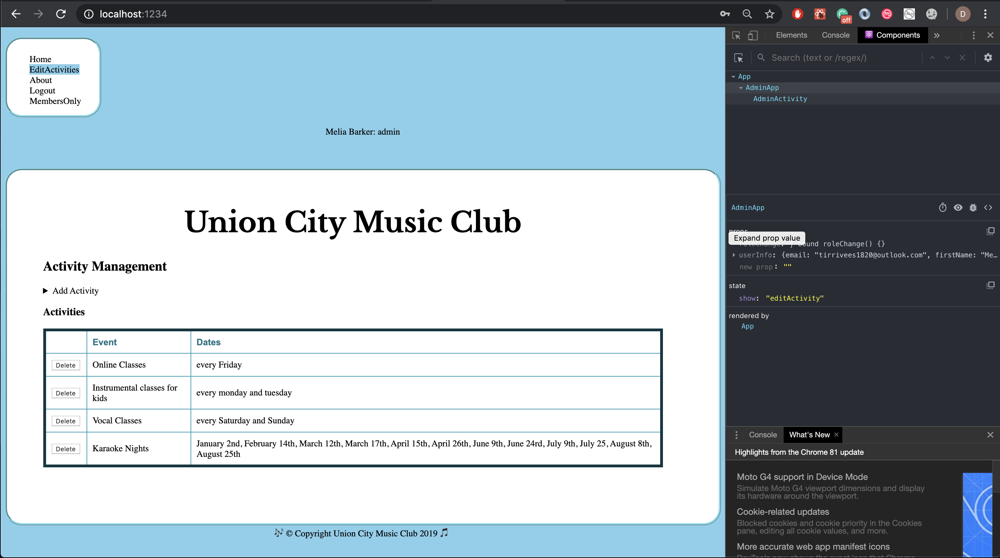
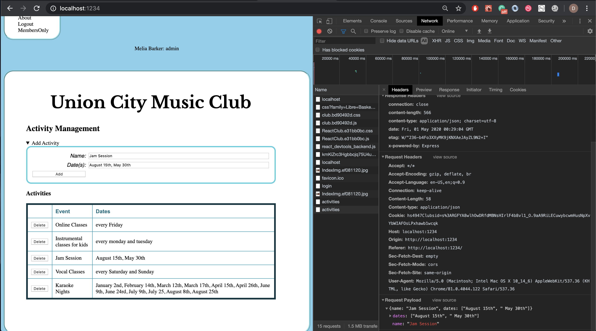
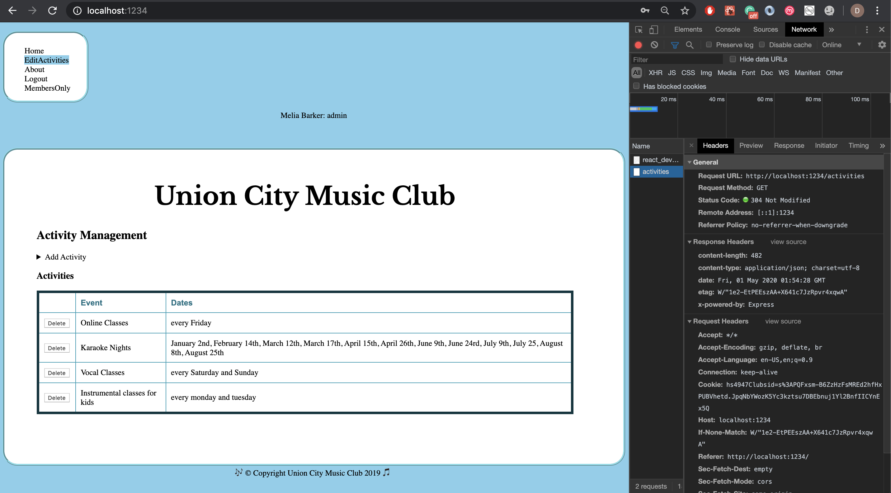
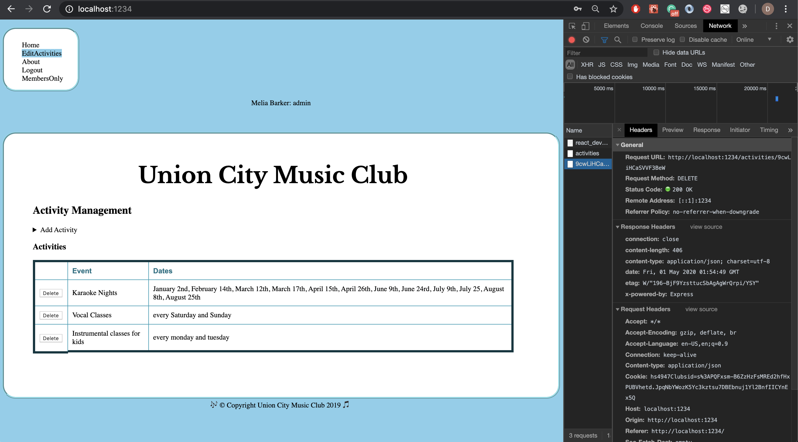
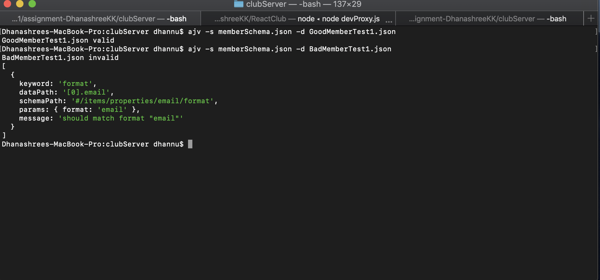
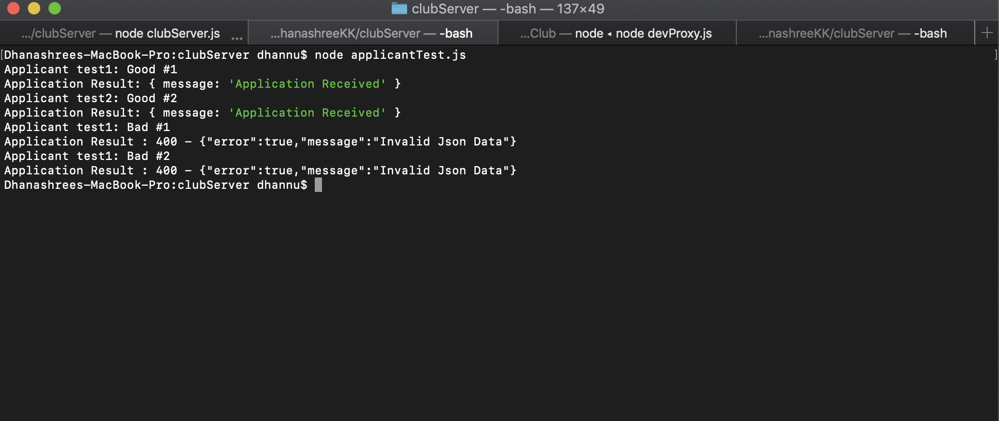

# Homework #11 Solution
**Student Name**:  Dhanashree Kamath Kasaragod

**NetID**: hs4947

## Question 1
### (a) 
``` AdminActivity.js
addActivity() {
	  let that = this;
	  let dateArr = (date.value).split(",")
      fetch('/activities', {
            method: 'POST',
            headers: {
                "Content-type": "application/json"
            },
            body: JSON.stringify({
                name:eventname.value,
                dates: dateArr
            }),
        }).then(function(response) {
            console.log('Request status code: ', response.statusText, response.status, response.type);
            if (response.status == 200) {
        		return response.json();}
        }).then(function(data) {
                console.log(data);
                that.setState({activityList:data})
        });
	}
```
### (b)
Screenshot of "addActivity" page before adding activity 
 

Screenshot of "addActivity" page after adding activity 



## Question 2 

### (a)
``` AdminActivity.js
deleteActivity(i) {
	
	  let that = this;
	  let id = this.state.activityList[i]._id;
	  console.log(id);

      fetch('/activities/'+id, {
            method: 'DELETE',
            headers: {
                "Content-type": "application/json"
            }
        }).then(function(response) {
            console.log('Request status code: ', response.statusText, response.status, response.type);
            if (response.status == 200) {
        		return response.json();
        	}
        }).then(function(data) {
                console.log(data);
                that.setState({activityList:data})
        });
    }

```
### (b)
Screenshot of "deleteActivity" page before deleting activity 
 

Screenshot of "deleteActivity" page after deleting activity 


## Question 3

### (a) 
To sign up 
* First name 
* Last name
* email
* password
* choose Activity
* choose a level
* Questions and comments


### (b)
``` memberSchema.json
{
  "$schema": "http://json-schema.org/draft-07/schema#",
  "id": "http://grotto-networking.com/schemas/MusicClubMembers",
  "title": "List of Union city music club members",
  "descriptions": "A schema for Club Members list. By Dhanashree",
  "type": "array",
  "items": {
    "type": "object",
    "properties": {
      "firstName": {
        "type": "string",
        "maxLength": 12
      },
      "lastName": {
        "type": "string",
        "maxLength": 12
      },
      "email": {
        "type": "string",
        "format": "email",
        "minLength":0
      },
      "password": {
        "type": "string",
        "pattern": "^(?=.*[0-9]+.*)(?=.*[a-zA-Z]+.*)[0-9a-zA-Z]{6,}$",
        "minLength": 6,
        "maxLength": 10
      },
      "chooseActivity": {
        "type": "string",
        "enum": ["karokeNights","instrument","vocal","online"]
      },
      "chooseALevel": {
        "type": "string",
        "enum": ["Beginner","Intermediate1","Intermediate2","Advanced"]
      },
      "questionsAndComments": {
        "type": "string",
        "maximum": 100
      }
    },
    "required": ["firstName", "lastName","email","password","chooseActivity","chooseALevel"],
    "additionalProperties": false
  }
}
```
### (b)
one of valid JSON data test
```GoodMemberTest1.json
[
  {
    "firstName":"Aksh",
    "lastName":"Rai",
    "email":"rai@gmail.com",
    "password":"1234Aza12",
    "chooseActivity":"karokeNights",
    "chooseALevel":"Beginner",
    "questionsAndComments":"hello have some question"
  }
]
```
one of the invalid JSON data test (invalid password)
```BadMemberTest1.json
[
  {
    "firstName":"Shaan",
    "lastName":"Jane",
    "email":"janegmail.com",
    "password":"678ADF",
    "chooseActivity":"instrument",
    "chooseALevel":"Advanced",
    "questionsAndComments":"hello have some question"
    }

]
```
Screen shot of checking valid and invalid data json using AJV


## Question 4

### (a)
```clubServer.js
app.post('/applicants', express.json(), function(req, res) {
  // console.log(req.body);
  let data = req.body;
  const ajv = new Ajv();
  var valid = ajv.validate(schema, data);
  console.log(valid);
  if (!valid) 
    res.status(400).json({"error": true, "message":"Invalid Json Data"});
 else
   res.json({"message":"Application Received"});
});
```
### (b)
```applicantTest.js
const rp = require('request-promise-native');

let goodApplicant1 = {
    url: 'http://127.0.0.11:1711/applicants',
    method: 'POST', // What does this do?
    resolveWithFullResponse: false,
    json:true,
    body: [
          {
            "firstName":"Aksh",
            "lastName":"Rai",
            "email":"rai@gmail.com",
            "password":"1234Aza12",
            "chooseActivity":"OnlineClass",
            "chooseALevel":2,
            "questionsAndComments":"hello have some question"
          }
        ]
};
let goodApplicant2 = {
    url: 'http://127.0.0.11:1711/applicants',
    method: 'POST', // What does this do?
    resolveWithFullResponse: false,
    json:true,
    body: [
        {
        "firstName":"Shaan",
        "lastName":"Jane",
        "email":"jane@gmail.com",
        "password":"678ADF",
        "chooseActivity":"Instrument Class",
        "chooseALevel":1,
        "questionsAndComments":"hello have some question"
        }

    ]

};
let badApplicant1 = {
    url: 'http://127.0.0.11:1711/applicants',
    method: 'POST', // What does this do?
    resolveWithFullResponse: false,
    json:true,
    body: [
        {
        "firstName":"Shaan",
        "lastName":"Jane",
        "email":"janegmail.com",
        "password":"678ADF",
        "chooseActivity":"Instrument Class",
        "chooseALevel":1,
        "questionsAndComments":"hello have some question"
        }

     ]

};
let badApplicant2 = {
    url: 'http://127.0.0.11:1711/applicants',
    method: 'POST', // What does this do?
    resolveWithFullResponse: false,
    json:true,
    body: [
        {
        "firstName":"Shaan",
        "lastName":"Jane",
        "email":"jane@gmail.com",
        "password":"678ADF",
        "chooseActivity":"Instrument Class",
        "chooseALevel":1.5,
        "questionsAndComments":"hello have some question"
    }
   ]

};

async function tests()
{
    //Test 1 check 1)call activities 2) call post good login (correct email, password), 3) logout.........
    try {
         console.log("Applicant test1: Good #1");
         let res1 = await rp(goodApplicant1);
         console.log("Application Result:",res1);
         console.log("Applicant test2: Good #2");
         let res2 = await rp(goodApplicant2);
         console.log("Application Result:",res2);
         console.log("Applicant test1: Bad #1");
         let res3 = await rp(badApplicant1);
         
     }
      catch (e) {
        console.log("Application Result :",e.message);
    }
    try {
        console.log("Applicant test1: Bad #2");
        let res4 = await rp(badApplicant2);
    }
    catch (e) {
         console.log("Application Result :",e.message);
    }
}
tests();
```
Applicant data testing 


## Question 5

### (a)
The major difference between WebSockets and Server-sent push notification is WebSockets are bidirectional where server can send message to client and vice versa. Push notifications are mono directional which only allows client to receive data from the server.
There is a limitation for maximum number of open connections for push notification, as the limit per browser is six where as WebSocket can handle upto 1024 connections per browser. WebSockets can transmit both binary data and UTF- 8. Push notification are limited to UTF-8.

WebSockets are used to send data. It is vastly applied in technologies like real time polling application, chat applications, media player etc. Push notifications are used in case of sending news feeds, media players, etc.
The performance for WebSocket is not guaranteed.


### (b)
1. websocket protocol(WS) or secure websocket protocol runs top of TCP.  
2. Message framing was added to the web scokets to provide two way communication as TCP is stream oriented, websockets understands messages not just bytes.  
3. yes, websocket work with both binary and text based data.  
4. Procedure for opening websocket starting from HTTP is called as "handshake".

### (c)
1. myWS = new WebSocket(url[, protocols]);  
Where url is the one to which WebSocket will respond. 
protocol will be either single or an  array of protocol strings. 
2. There is no limit to the number of established websocket connections a client can have with the a single remote host.
3. WebSocket.close() method closes the websocket connection or connection attempt if any. Therefore client can check the connection is closed or not using read- only property called WebSocket.readyState.  
For example :  
var readyState = aWebSocket.readyState;  
this will return 3 if the connection is closed or couldn't be reopened.  OR   
We can check if(wsObj.readyState === webSocket.CLOSED){}

### (d)
1. HTTP server is not same as the WebSocket server. WebSocket protocol and HTTP both enables two way communication. The difference between these two are WebSocket protocol is bidirectional therefore even server can send the message to client and vice versa. In HTTP protocol server cannot make an HTTP request to a client.It will only respond when client makes a request.  
HTTP protocol is half duplex means both client and server can communicate with each other but not simultaneously. It is one direction at a time where as WebSocket protocol is full duplex both clinet and server can communicate with each other simultaneously.
2. Express.js is an HTTP(S) server framework not a WebSocket Server.  
3. WebSocket allows client to make unlimited number of connections to the target server and thus resources on the server can be exhausted because of DOS attack(unlimited unauthorized access so the authorized users may not be able to access the connection) and also to prevent Cross Site WebSocket Hijacking. Therefore, it is good practice to only allow authenticated users to establish a successful websocket connection.

### (e)
1. yes.
2. These are the some of reason why server offer multiple different (named) WebSockets to clients
* Transfer of encrypted and unencrypted data separately
* Textual and binary data as 2 separate Websockets so that Websockets can take care of the deserialization
* Server supports multiple different websocket sub-protocols, and the page requires access to more than one. The reason we require more than one websocket is because it is limited to a single sub-protocol
* To keep track of clients and also for authentication purpose so that no two clients can interrupt each other.
The same web server and port may have multiple different websocket services. The client can choose per connection depending on the URI path, scheme or sub-protocol.
* Use cases that which differ in terms of latency requirements. This can be in terms of streaming versus low latency use case
3. Server will have to keep track of client's socket to avoid repeated handshakes with already confirmed clients. If we don't track then the same client IP adress may try to connect multiple times but the server can deny the attempt inorder to save itself from Denial-of-Service attacks.
For example, we can keep table of username or ID numbers along with the corresponding websocket and other data we need to associate with the connection.


