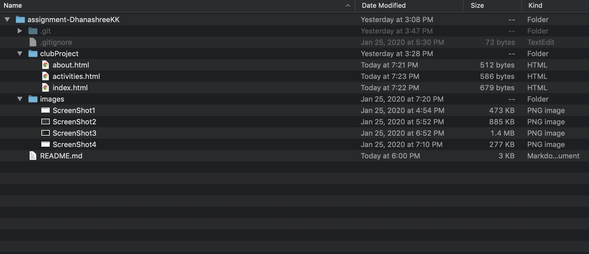
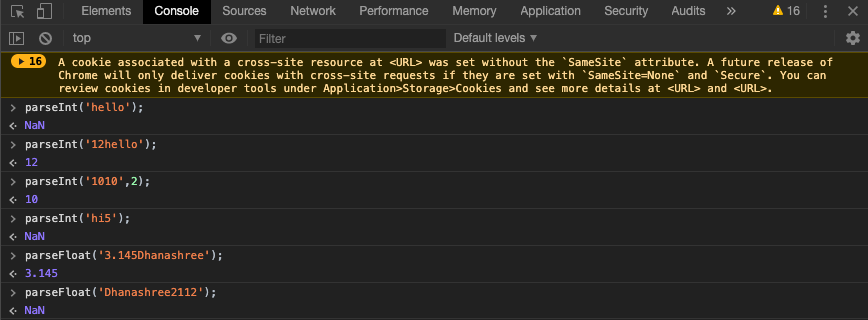
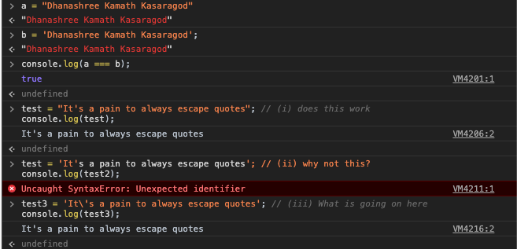
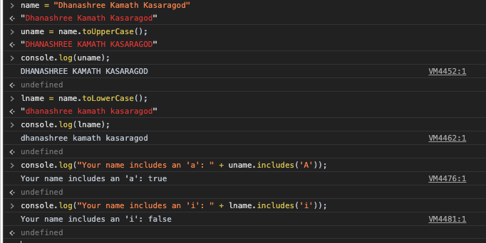
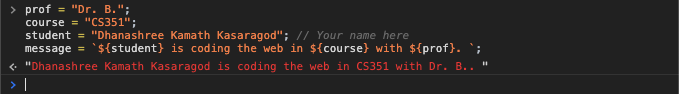

# Homework #2 Solution
**Student Name**:  Dhanashree Kamath Kasaragod

**NetID**: hs4947

## Question 1
### (a)
#### tags
1. `<nav></nav>`
2. `<a></a>`
3. ``
#### attributes
1. `class="navbar navbar-expand-sm navbar-dark bg-dark sticky-top"`
2. `class="navbar-brand d-none d-md-block"`
3. `href="#"`
4. `alt="Grotto Networking" `
5. `src="/images/sideLogo.png" `
6. `style="width: 150px"`

### (b)
An element can have only one (or no) id and it must be unique within the HTML document. id attributes as targets for links is one of the factors that contributes to it needing to be unique. There are also other factors like style linking using CSS and javascript linking.

We can use the same class on multiple elements in a document.This is helpful when we need to style two different element in same way.We can reuse the existing class insted of writing new one.

### (c)
1)
```
body {
  padding-bottom: 50px;
}
```
 
- selector - basic
- type - type selector
- properties - padding-bottom
- value - 50px

2)
```
#RelatedItems {
  max-height: 50vh;
  overflow-y: auto;
}
```
- selector - basic
- type - ID selector
- properties
  - overflow-y
  - max-height
- value
  - 50vh
  - auto
3)
```
.graphDrawing {
  border: dashed thin #808080;
  border-radius: 5px;
  width: 90%;
  margin: 0;
  margin-bottom: 25px;
}
```

- selector - basic
- type - class selector
- properties
  - border
  - border-radius
  - width
  - margin
  - margin-bottom
- value 
  - dashes thin #808080
  - 5px
  - 90%
  - 0
  - 25px

### (d)

article figcaption - It is a decendent selector, all the figcaption element under article tag will take the properties mentioned under article figcaption.

a.navbar-brand img - This is also decendent selector but the properties described under a.navbar-brand img will be applied only to the img element of class a and class name navbar-brand.


## Question 2
### (a)


### (b)
(i)  The `<main>` of a document must include a unique content. Navigation links may appear multiple times in a document .So it is not a best practice to use it inside `<main>` but it is possible to put site wide navigation inside `<main>` if the document or application's `<main>` is of search form.

(ii) banner is possible to put inside main if its relevent to the `<main>` content.It is better to use `<header>` as banner and need to ensure that it is not descendent of any subsection of the page. 

(iii) Best practice to put copyright information is outside `<main>` It is possible to put copyright notices in the `<main>` element but it is not a good practice.

List of files:
- index.html
- about.html
- activities.html


### (c)

According to the [HTML5.2 Spec-header](https://www.w3.org/TR/2017/REC-html52-20171214/sections.html#the-header-element) `<header>` represents tbe introductory contenet for the nearest `<main>`. If the `<header>` is generic elements it will remain outside `<main>`. Sometimes we can see header inside `<main>` if it contains relevent heading and in page navigation.

### (d)

According to the [HTML5.2 Spec-footer](https://www.w3.org/TR/2017/REC-html52-20171214/sections.html#the-footer-element) `<footer>` contains information about who wrote it, links and copyright, etc. One of the reasons it is at the bottom of the body tag, is so that assistive technogolies can provide information on the type of the content. It is also easy to represent author information. If the `<footer> `content is relevent to the `<main>` content.

### (e)

  

### (f)

#### HTML code of the index.html page
```
<!DOCTYPE html>
<html lang="en"> <!-- English -->
<head>
  <title>Home Page</title>
  <link rel="stylesheet" href="styles.css">
</head>
<!-- I'm an HTML comment -->
<body> <!-- Nothing here yet. -->
  <nav>
    <ul>
      <li class="active"><a href="index.html">Home</a></li>
      <li><a href="activities.html">Activities</a></li>
      <li><a href="about.html">About</a></li>
    </ul>
  </nav>
  <main>
    <h1>Union City Music Club</h1>
    <p>Union city music is the best destination for the music lovers to interact and perform.It provides ways for people to learn , mentor and play music. It is not only for professionals but also for hobbyists.</p>
  </main>
  <footer>&copy; Copyright Union City Music Club 2019 </footer>
</body>
</html>
```
## Question 3
### (a)
(i) `parseInt('hello');`- If the first character cannot be converted to a number it will return Nan. Nan is not a number.
(ii)`parseInt('12hello');`- It parsed string and returned  12.
(iii)`parseInt('1010',2);`- number in the string is parsed from binary(radix =2) to a decimal number and returns answer as 10.
(iv)`parseInt('hi5');`-It is not same as (ii) the answer for this is Nan . It is because first character couldn't be converted as integer.

(v)`parseFloat(3.145Dhanashree);`- 3.145
(vi)`parseFloat(Dhanashree2112);`- NaN

 

### (b)


### (c)

(i)
```
test = "It's a pain to always escape quotes";
console.log(test);
```
This code snippet works.

(ii)
```
test2 = 'It's a pain to always escape quotes'; 
console.log(test2);
```
javascript interpret 'It's as the end of the string.

(iii)
```
test3 = 'It\'s a pain to always escape quotes'; 
console.log(test3);
```
backslash ( \ ) character is used to prevent javascript from interpreting a quote 'It\'s as the end of the string.

 

### (d)
(i)
```
name = "Dhanashree Kamath Kasaragod"
uname = name.toUpperCase(); 
console.log(uname);
```
This will convert the given name to uppercase letters. uname = "DHANASHREE KAMATH KASARAGOD".

(ii)
```
lname = name.toLowerCase(); // (ii) What?
console.log(lname);
```
This will convert the given name in to lower case letter. lname = "dhanasshree kamath kasaragod".

(iii)
```
console.log("Your name includes an 'a': " + uname.includes('A'));
console.log("Your name includes an 'i': " + lname.includes('i'));
```
include function will determine a string contains specified character 'A' and 'i' in the uname and lname.

 

### (d)

 

## Question 4
### (a)


### (b)


### (c)


## Question 5
### (a)


