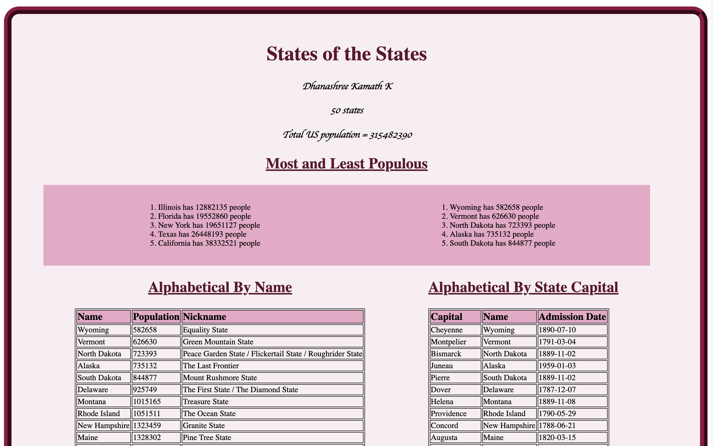

# Homework #3 Solution
**Student Name**:  Dhanashree Kamath Kasaragod

**NetID**: hs4947

## Question 1
### (a)
List of Image pages

1)index.html

2)activities.html

 

### (b)
🎶 MULTIPLE MUSICAL NOTES
127926
U+1f3b6

🎵 MUSICAL NOTE
127925
U+1f3b5


 

## Question 2

### (a)


### (b)
URL : http://csweb01.csueastbay.edu/~hs4947/clubProject/index.html

## Question 3

### (a)   
```javascript
document.title = "States Info hs4947";
document.getElementById("Author").innerHTML =  "Dhanashree Kamath K";
 ```                   
### (b)

Number of states and total population
```javascript
document.getElementById("Number").innerHTML = states.length + " " + "states";


        // total population
        let initialValue = 0
        let totalPopulation = states.reduce(
            (accumulator, currentValue) => accumulator + currentValue.population
            , initialValue
            )

        console.log(totalPopulation);
        document.getElementById("TotalPop") .innerHTML = " Total US population = " + totalPopulation;
```

### (c)
```javascript
        // total population
        let initialValue = 0
        let totalPopulation = states.reduce(
            (accumulator, currentValue) => accumulator + currentValue.population
            , initialValue
            )

        console.log(totalPopulation);
        document.getElementById("TotalPop") .innerHTML = " Total US population = " + totalPopulation;


        //sort states array by population
        states.sort(function (a, b) {
          return a.population - b.population;
      });

        fiveMost();
        fiveLeast();

        function fiveLeast()
        {
            states.slice(0,5).map(item => addLi(item,"least"));
        }

        function fiveMost()
        {
            states.slice(45,50).map(item => addLi(item,"most"));
        } 

        function addLi(stateItem, className) {
            var liChild = document.createElement("li");
            var childInfo = document.createTextNode(stateItem.state+" has "+stateItem.population+" people");
            liChild.appendChild(childInfo);
            document.getElementsByClassName(className)[0].appendChild(liChild);
        }

```


 ## Question 4

 ### (a)
```javascript
        //Sort by state in alphabetical order
        states.sort(function(a, b) {
        var nameA = a.state// ignore upper and lowercase
        var nameB = b.state // ignore upper and lowercase
        if (nameA < nameB) {
          return -1;
        }
        if (nameA > nameB) {
          return 1;
        }
        // names must be equal
        return 0;
        });
        function stateTableName{
            var sectionElem = document.getElementById('AlphaName');
            var tbodyElem = sectionElem.getElementsByTagName("tbody");
            states.map(stateItem => addTablebyName(stateItem));
        }

        function addTablebyName(stateItem) {
            var trChild = document.createElement("tr");
            var tdNameChild = document.createElement("td");
            var tdNameText = document.createTextNode(stateItem.state);
            var tdPopulationChild = document.createElement("td");
            var tdPopulationText = document.createTextNode(stateItem.population);
            var tdNickNameChild = document.createElement("td");
            var tdNickNameText = document.createTextNode(stateItem.nickname);
            tdNameChild.appendChild(tdNameText);
            trChild.appendChild(tdNameChild);
            tdPopulationChild.appendChild(tdPopulationText);
            trChild.appendChild(tdPopulationChild);
            tdNickNameChild.appendChild(tdNickNameText);
            trChild.appendChild(tdNickNameChild);
            tbodyElem[0].appendChild(trChild)
        }

```
## (b)
```javascript
 //Sort by capital in alphabetical order
        states.sort(function(a, b) {
          var nameA = a.capital_city// ignore upper and lowercase
          var nameB = b.capital_city // ignore upper and lowercase
          if (nameA < nameB) {
            return -1;
          }
          if (nameA > nameB) {
            return 1;
          }

          // names must be equal
          return 0;
        });

        function stateTableCapital(){
            var sectionElem = document.getElementById('AlphaCapital');
            var tbodyElem = sectionElem.getElementsByTagName("tbody");
            states.map(stateItem => addTablebyCapital(stateItem,tbodyElem));
        }

        function addTablebyCapital(stateItem,tbodyElem) {
            var trChild = document.createElement("tr");
            var tdCapitalChild = document.createElement("td");
            var tdCapitalText = document.createTextNode(stateItem.capital_city);
            var tdNameChild = document.createElement("td");
            var tdNameText = document.createTextNode(stateItem.state);
            var tdAdDateChild = document.createElement("td");
            var tdAdDateText = document.createTextNode(stateItem.admission_date);
            tdCapitalChild.appendChild(tdCapitalText);
            trChild.appendChild(tdCapitalChild);
            tdNameChild.appendChild(tdNameText);
            trChild.appendChild(tdNameChild);
            tdAdDateChild.appendChild(tdAdDateText);
            trChild.appendChild(tdAdDateChild);
            tbodyElem[0].appendChild(trChild)
        }
 ```

 ### (c)


 ## Question 5


