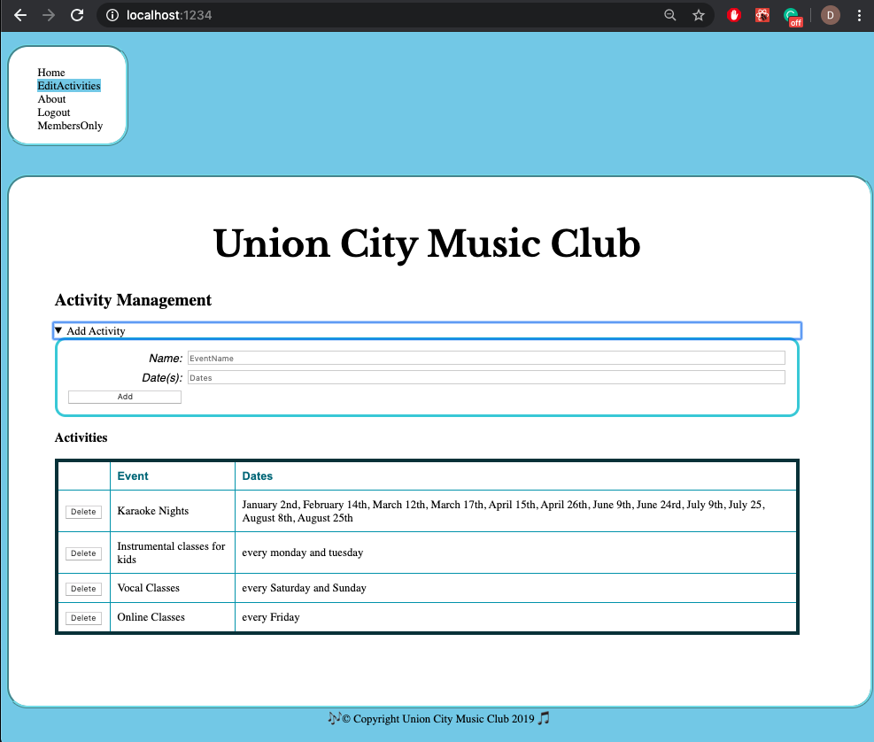
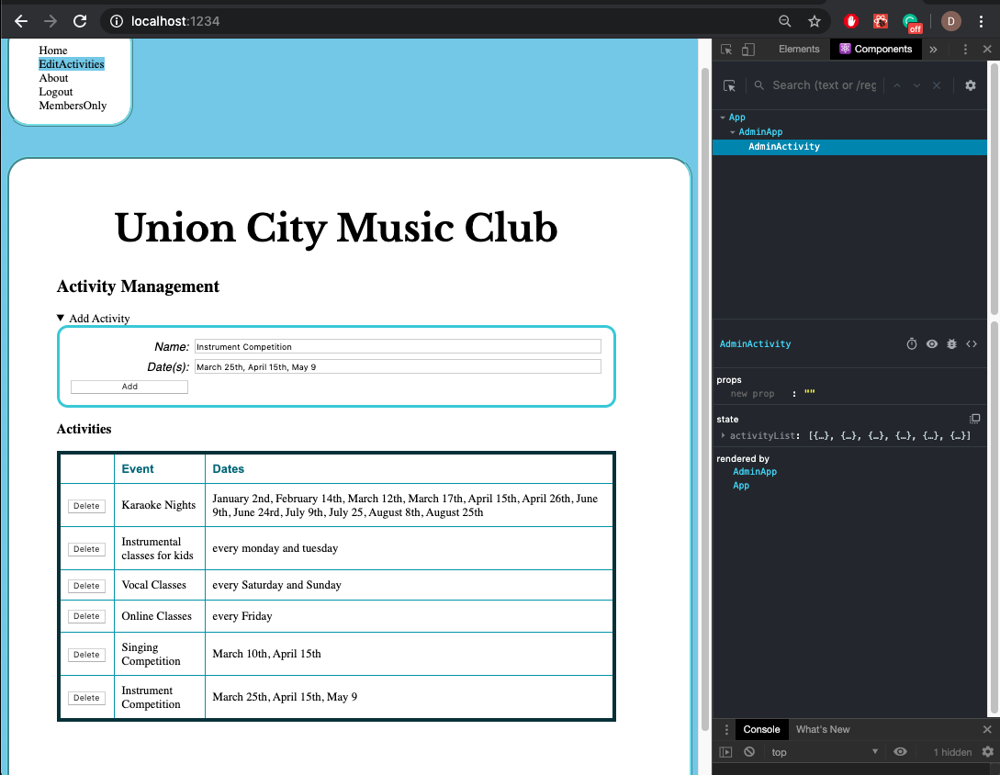

# Homework #7 Solution
**Student Name**:  Dhanashree Kamath Kasaragod

**NetID**: hs4947

## Question 1
### (a)
Revised directory structure (sub folder admin, guest and admin under ReactClub)


### (b)
Activity administration mockup


### (c)
We use class component. In order to save state of activities and rerender the newly added activity we need to use class component

before adding activity :


after adding activity:


### (d)

Constructor function of adminActivity.js
```adminActivity.js
constructor(props)
	{
		super(props);
		this.state = { activityList:activityList};
	}
```
### (e)
JSX code of widegts for adding activity
``` JSX
	<header>
		<h1 className="fh-custom-font"> Union City Music Club</h1>
		<h2> Activity Management</h2>
		</header>
		<details>
		<summary>Add Activity</summary>
		<section id = "loginForm">
		<label htmlFor="name">Name: </label>
		<input type="text" name="eventname" id="eventname" required placeholder="EventName"/>
		<label htmlFor="date">Date(s): </label>
		<input type="text" name="date" id="date" placeholder="Dates"/>
		<label htmlFor="imageSelect">Choose a image:</label>

		<select name="eventimage" id="eventimage">
		<option value="">--Please choose an option--</option>
		<option value="KaraokeImg">image1</option>
		<option value="KidInstrument">image2</option>
		<option value="VocalImage">image3</option>
		</select>
		<button type="button" id = "Add" onClick = {this.addActivity.bind(this)} >Add</button>
		</section>
		</details>
```

### (f)
event handling function of adminActivity.js which is called when add button is clicked in add activity section
``` adminActivity.js
addActivity() {
		let dateArr = (date.value).split(",")
		let newEventDict = {name:eventname.value,dates: dateArr,image:eventimage.value};
		this.setState({activityList:this.state.activityList.concat(newEventDict)});
		
	}
```
## Question 2 

### (a)


### (b)

## Question 3

### (a)   


### (b)


## Question 4

### (a)


### (b)


### (c)


## Question 5

### (a)


### (b)


### (c)


