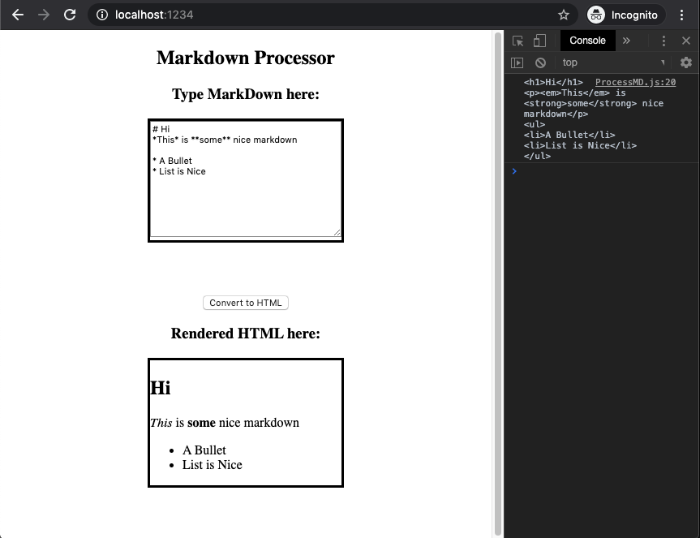

# Homework #5 Solution
**Student Name**:  Dhanashree Kamath Kasaragod

**NetID**: hs4947

## Question 1
### (a)
* Node.js version - v12.16.1
* npm version - 6.13.7


### (b)


### (c)


### (d)


## Question 2 

### (a)


### (b)


### (c)


## Question 3

### (a)   

### (b)
code inside ```<body>```  of processMD.html 
``` html
<body> <!-- Nothing here yet. -->
	<section class="central">
	<h1 >Markdown Processor</h1>
	<h3 >Type MarkDown here:</h3>
	<section id ="input" class="main_section">
		<textarea id="inputTA"></textarea>
	</section>
	<button id="convert"> Convert to HTML</button>
	<h3 > Rendered HTML here:</h3>
</section>
	<section id="output" class="main_section"></section>
	<script src ="./ProcessMD.js"></script>
</body>
```
code of  of processMD.js 
``` javascript

import commonmark from "commonmark";

function getHtmlElements() {

var convertBtn = document.getElementById("convert");
convertBtn.addEventListener("click",onClickOfConvertBtn);
var output = document.getElementById("output");
}

function onClickOfConvertBtn() {
	var inputText = document.getElementById("inputTA").value;
	var reader = new commonmark.Parser();
	var writer = new commonmark.HtmlRenderer();
    var parsed = reader.parse(inputText); // parsed is a 'Node' tree
	// transform parsed if you like...
	var result = writer.render(parsed);
	console.log(result);
	output.innerHTML = result;
 
}

window.onload = function() {
	getHtmlElements();
};
```



## Question 4

### (a)
```
import hljs from 'highlight.js';
import 'highlight.js/styles/idea.css';
```
There is nothing odd about the above code. Highlight.js is a syntax highlighter written in JavaScript. It works in the browser and on the server. It works with markup and doesn't depend on any framework .It also has automatic language detection.
By installing npm package it will create packge.json node module in which all the css and js files will be downloaded . Then by using import satement we can use required CSS .

### (b)

``` javascript
import commonmark from "commonmark";
import hljs from 'highlight.js';
import 'highlight.js/styles/idea.css';

function getHtmlElements() {
var convertBtn = document.getElementById("convert");
convertBtn.addEventListener("click",onClickOfConvertBtn);
var output = document.getElementById("output");
}

function onClickOfConvertBtn() {
	var inputText = document.getElementById("inputTA").value;
	var reader = new commonmark.Parser();
	var writer = new commonmark.HtmlRenderer();
    var parsed = reader.parse(inputText); // parsed is a 'Node' tree
	// transform parsed if you like...
	var result = writer.render(parsed);
	console.log(result);
	output.innerHTML = result;
	// Highlighting code
	output.querySelectorAll('pre code').forEach((block) => {
		hljs.highlightBlock(block);
	});
 
}

window.onload = function() {
	getHtmlElements();
};
```


### (c)
[LinkToCustomMarkdown](http://csweb01.csueastbay.edu/~hs4947/hw5/)


### (d)

* CSS file- ProcessMD.5c138e5f.css"> 
File Size - 980 bytes
* script file -"ProcessMD.5b9da170.js"> 
File Size - 890 KB

Yes, The file size seems bit larger. It is because we are importing large library and using very few functions of it in this project.Instead of that if we pick and choose specific functions or components, which are required for the project then it is possible to reduce the file size.


## Question 5

### (a)


``` javascript 
import React from "react";
import ReactDOM from "react-dom";
import chemElements from "./elements.json";

// What is this? HTML mixed with JavaScript
let htmlTags = <div>
			   <h1> The Periodic Table</h1>
    		   <h2> Brought to you by Dhanashree Kamath Kasaragod and Net ID hs4947</h2>
    		   <p> There are {chemElements.length} chemical elements. </p>
    		   </div>;
ReactDOM.render(
    htmlTags,
    document.getElementById("root")
);
```
### (b)
``` javascript
import React from "react";
import ReactDOM from "react-dom";

export default function PeriodicTable(props) {
	return <table><thead><tr>
	{(props.desiredCols).map((colName) =>
		<th key={colName}>{colName}</th>
	)}
	</tr>
	</thead>
	<tbody>
	{(props.chemElements).map((chemElement) =>
		<tr key = {chemElement.atomic_number}>
		<td>{chemElement.atomic_number}</td>
  		<td>{chemElement.name}</td>
  		<td>{chemElement.symbol}</td>
  		<td>{chemElement.phase}</td>
  		<td>{chemElement.year_of_discovery}</td>
  		</tr>
	)}
	</tbody>
	</table>;
}
```


