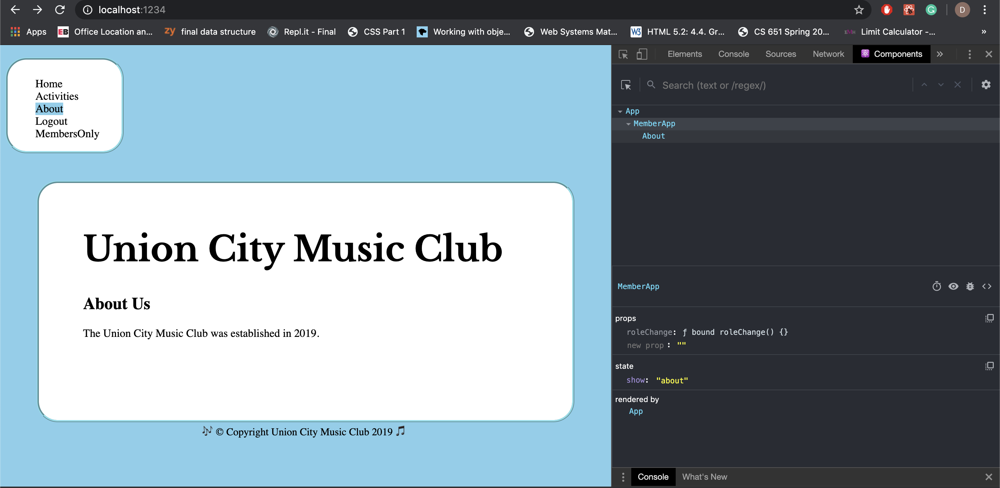
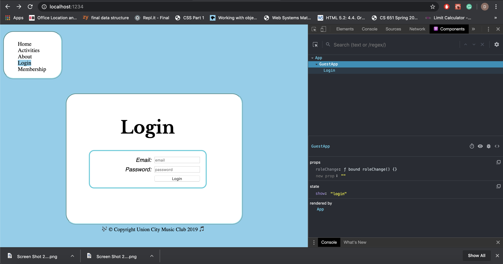

# Homework #6 Solution
**Student Name**:  Dhanashree Kamath Kasaragod

**NetID**: hs4947

## Question 1
### (a)

### (b)


### (c)
Guest App


Member App


Admin App


### (d)
As of now club main page is kept inside index.js along with state change code.
```index.js
import React from "react";
import ReactDOM from "react-dom";
import indexImg from "./clubimages/IndexImg.jpg";
import "./club.css";
import MemberApp from "./memberApp";
import AdminApp from "./adminApp";
import GuestApp from "./guestApp";


class App extends React.Component {
	constructor(props) {
		super(props);
        this.state = {role: "guest"}; // We will have "user" and "admin" roles too.
    }
    // Renders component based on current state and props
    render() {
    let contents = null;
        switch (this.state.role) {
            case "member":
                contents = <MemberApp role={this.state.member}/>;
                break;
            case "admin":
                contents = <AdminApp role={this.state.admin}/>;
                break;
            case "guest":
                contents = <GuestApp role={this.state.guest}/>;
                break;
            default:
                contents = <h2>Warning something went wrong!!!</h2>;
        }

    let mainPageBody = <div className ="divStyle">
	<main className ="box">
		<header>
			<h1 className="fh-custom-font"> Union City Music Club</h1>
			<h2> Introduction</h2>
		</header>
		<p>Union city music is the best destination for the music lovers to interact and perform.It provides ways for people to learn , mentor and play music. It is not only for professionals but also for hobbyists.Learn from expert teachers.</p>
		<figure>
			
			<figcaption>Music Club,Union City.</figcaption>
		</figure>
	</main>
	<footer>&#127926;&copy; Copyright Union City Music Club 2019 &#127925; </footer>
	</div>;

        return <div>
        {contents}
        {mainPageBody}
        </div>

   
    }
}
ReactDOM.render(<App />, document.getElementById("root"));
```

## Question 2 

### (a)


### (b)
``` guestApp.js
import React from "react";
import ReactDOM from "react-dom";
import HomeClub from "./Home";
import AboutClub from "./About";

class GuestApp extends React.Component {
	constructor(props) {
		super(props);
		this.state = {show: "home"}
	}
	homeHandler(event)
	{
		this.setState({show:"home"});
	}
	aboutHandler(event)
	{
		this.setState({show:"about"});
	}

	loginHandler(event)
	{
        this.setState({show:"login"});
	}
	activityHandler(event)
	{
		this.setState({show:"activities"});
	}
	membershipHandler(event)
	{
		this.setState({show:"membership"})
	}
   


 render(){ 
        let navBar = <nav className="navbox">
		<ul className = "main-menu">
			<li className = {this.state.show == "home" ? "active" : null}><a onClick={this.homeHandler.bind(this)}>Home</a></li>
			<li className = {this.state.show == "activities" ? "active" : null}><a onClick={this.activityHandler.bind(this)}>Activities</a></li>
			<li className = {this.state.show == "about" ? "active" : null}><a onClick={this.aboutHandler.bind(this)}>About</a></li>
			<li className = {this.state.show == "login" ? "active" : null}><a onClick={this.loginHandler.bind(this)}>Login</a></li>
			<li className = {this.state.show == "membership" ? "active" : null}><a onClick={this.membershipHandler.bind(this)}>Membership</a></li>
		</ul>
	</nav>;
	
	let contents = null;
	switch (this.state.show) {
            case "home":
                contents = <HomeClub role={this.state.home}/>;
                break;
            case "about":
                contents = <AboutClub role={this.state.about}/>;
                break;
            default:
                contents = <h2>This page is not implemented yet!!!</h2>;
        }
        return <div className="bodyStyle">{navBar}{contents}</div>
    }

}

export default GuestApp;
```
GuestApp home state


GuestApp about state


GuestApp login state


### (c)


## Question 3

### (a)   

Member State 



### (b)

Admin State


## Question 4

### (a)
Login 




### (b)

``` function added to the class App in index.js
constructor(props) {
		super(props);
		this.roleChange = this.roleChange.bind(this);
        this.state = {role: "guest"}; 
        this.userInfo = null;// We will have "user" and "admin" roles too.
    }

    roleChange(roleVal, userInfo) {
     	this.setState({role: roleVal})
     	this.userInfo = userInfo;
     	console.log(userInfo)
    }
```

``` code in Login.js to handle login button click

import React from "react";
import ReactDOM from "react-dom";


class Login extends React.Component {
  constructor(props)
  {
  	super(props)
  	{
  		this.roleChange = props.roleChange;
		this.loginParse = this.loginParse.bind(this);
  	}
  }

 loginParse() {
	let userinfo = {"name": "Dhanashree Kamath K", "NetID": "hs4947"};
	if(email.value == "admin@email.org")
      	this.roleChange("admin", userinfo)
     else if (email.value == "member@email.org")  
        this.roleChange("member", userinfo)
     else
     	this.roleChange("guest", userinfo)
}

render()
{
	return <div><main className ="box">
		<header>
			<h1 className="fh-custom-font">Login</h1>
		</header>
		<section id="loginForm">
			<label htmlFor="email">Email: </label>
			<input type="email" name="email" id="email" required placeholder="email" />
			<label htmlFor="password">Password: </label>
			<input type="password" id="password" placeholder="password"/>
			<button type="button" id = "loginBtn" onClick={this.loginParse}>Login</button>
		</section>
	</main>
	<footer>&#127926;&copy; Copyright Union City Music Club 2019 &#127925; </footer>
	</div>;
}
	
}

export default Login;
```


### (c)

``` code snippet od adminApp.js to logout 
logoutHandler(event)
	{
		this.setState({show:"logout"});
		this.roleChange("guest"," ");

	}
```

## Question 5

### (a)
``` activities.json
[{"name": "Karaoke Nights",
           "dates": ["January 2nd","February 14th","March 12th", "March 17th", "April 15th", "April 26th",
                     "June 9th", "June 24rd", "July 9th", "July 25",
                     "August 8th", "August 25th"],
           "image":"clubimages/KaraokeImg.jpg"},
         {"name": "Instrumental classes for kids",
          "dates": ["every monday and tuesday"],
          "image":"clubimages/KidInstrument.jpg"},
         {"name": "Vocal Classes", 
         "dates": ["every Saturday and Sunday"],
          "image":"clubimages/VocalImage.jpg"},
          {"name": "Online Classes", 
         "dates": ["every Friday"],
          "image":"clubimages/OnlineImg.jpg"}];
```

### (b)


