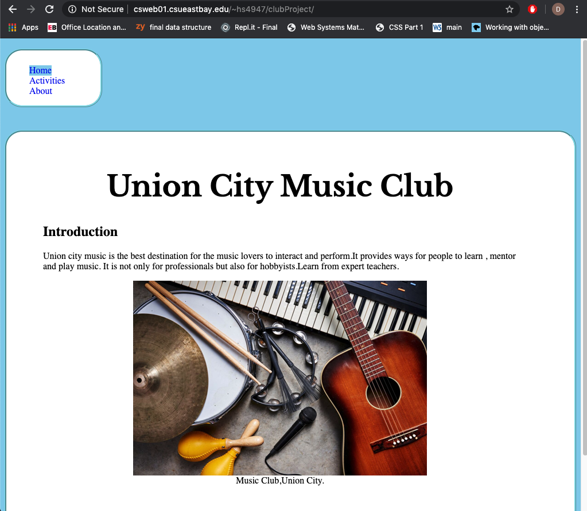

# Homework #3 Solution
**Student Name**:  Dhanashree Kamath Kasaragod

**NetID**: hs4947

## Question 1
### (a)
List of Image pages

1)index.html

2)activities.html

 

### (b)
🎶 MULTIPLE MUSICAL NOTES
127926
U+1f3b6

 

## Question 2

### (a)

### (b)
URL : http://csweb01.csueastbay.edu/~hs4947/clubProject/index.html

