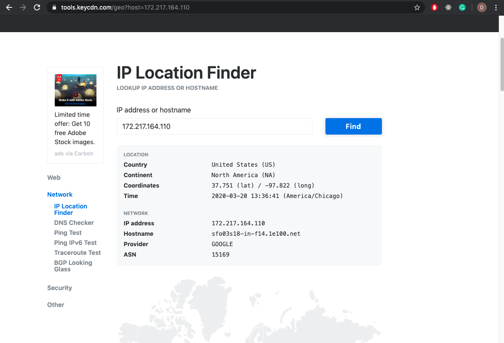

# Homework #7 Solution
**Student Name**:  Dhanashree Kamath Kasaragod

**NetID**: hs4947

## Question 1
### (a)
Revised directory structure (sub folder admin, guest and admin under ReactClub)


### (b)
Activity administration mockup


### (c)
We use class component. In order to save state of activities and rerender the newly added activity we need to use class component

after adding activity:


### (d)

Constructor function of adminActivity.js
```adminActivity.js
constructor(props)
	{
		super(props);
		this.state = { activityList:activityList};
	}
```
### (e)
JSX code of widegts for adding activity
``` JSX
	return <div><main className ="box">
		<header>
		<h1 className="fh-custom-font"> Union City Music Club</h1>
		<h2> Activity Management</h2>
		</header>
		<details>
		<summary>Add Activity</summary>
		<section id = "loginForm">
		<label htmlFor="name">Name: </label>
		<input type="text" name="eventname" id="eventname" required placeholder="EventName"/>
		<label htmlFor="date">Date(s): </label>
		<input type="text" name="date" id="date" placeholder="Dates"/>
		
		<button type="button" id = "Add" onClick = {this.addActivity.bind(this)} >Add</button>
		</section>
		</details>

```

### (f)
event handling function of adminActivity.js which is called when add button is clicked in add activity section
``` adminActivity.js
addActivity() {
		let dateArr = (date.value).split(",")
		let newEventDict = {name:eventname.value,dates: dateArr};
		this.setState({activityList:this.state.activityList.concat(newEventDict)});
		
	}
```
## Question 2 

### (a)
prior to the deletion of event:


after deleting some event:


### (b)
JSX in adminActivity for calling deleteEvent() function:
```JSX
{(this.state.activityList).map((activity,i) => {
	
	return <tr key = {"activity"+i}>
	<td><button type="button" id = "Delete" onClick={that.deleteActivity.bind(that,i)}>Delete</button></td>
	<td>{activity.name} </td>
	<td> {(activity.dates).join(", ")}</td>
	</tr>
}

```
I have not used any sub-components. All the functionality is in the same component.

### (c)
function to deletActivity in adminActivity.js to delete activity
``` javascript
deleteActivity(i) {
		let newArray = this.state.activityList.filter(function(activity, index){
			if (index === i) 
				return false;
			else 
				return true;
		})
		console.log(newArray)
		this.setState({activityList:newArray});

	}
```
## Question 3

### (a)   


### (b)


### (c)
 address: '127.0.0.1', this address is used for loopback addresses to the local host.
 address: '10.0.0.66', used for local communications within a private network.

### (d)

IP address returned after running given code is: [ '172.217.164.110' ]

### (e)
IP location finder for IP adress mentioned in (e)


## Question 4

### (a)
The two purposes that JavaScript ascribe to this keywords are:
1) It is used to point to an instance of an object from within its own class definition
2) It is also used to keep track of exection context- which is often based on where a function was called from.

### (b)

```javascript
myObj1 = {course: "WebDev", students: 36};
myObj2 = {course: "WebSys", students: 31};
var myFunction = function () {
  console.log(this);
};

myFunction(); // this?
myObj1.method1 = myFunction;
myObj1.method1(); // this?
func2 = myObj1.method1.bind(myObj2);
func2(); // this?
```

1) myFunction(); 
*this* will return {parent: Window, opener: null, top: Window, length: 4, frames: Window, …}
By default *this* should always be the window Object, which referes to the root. When we call console.log(this) from myFunction, as it is invoked by window, *this* value will be window object.

2) myObj1.method1();
*this* {course: "WebDev", students: 36, method1: ƒ}
myfunction is called by myObj1 object so it will return its myObj1 values.

3) func2();
func2 will return {course: "WebSys", students: 31}
Here func2 is assigned to the method of myObj1 which is bound to the instance of myObj2.Therefore func2() call will return the myObj2 values.(changed the context of function)



### (c)


setTimeout(cs651); 
SetTimerout() sets a timer which executes a function or specified piece of code once the timer expires. In this case it will execute cs651 function once the timer expires.

setTimeout(cs351, 0);
This is not different than previous function becuase, in the previous function delay is not specified and by default it is 0
here delay is explicitly specifies as 0.

### (d)
``` javascript
function winner(name) {
  console.log(`The winner is ${name}`);
}
myP1 = new Promise(function(resolve, reject){
    setTimeout(()=>resolve("P1"), 1000*Math.random());
});
myP2 = new Promise(function(resolve, reject){
    setTimeout(()=>resolve("P2"), 1000*Math.random());
});
myP3 = new Promise(function(resolve, reject){
    setTimeout(()=>resolve("P3"), 1000*Math.random());
});
myPs = [myP1, myP2, myP3];
racingPs = Promise.race(myPs);
```
Promise is an object representing the ultimate completion or failure of an asynchronous operation. The below Promise.race(myPs)  method returns promises (myP1,myP2,myP3) that fulfills or rejects as soon as one of the promises fulfills or reject, with the value or reason from that promise.

The promise which returns first is the winner of the "promise race". One of the method to find out the winner in the given code, is to modify 
 Promise.Race with then() which takes callback function to return sucess or failure . 
 ex:racingPs = Promise.race(myPs).then(winner);


