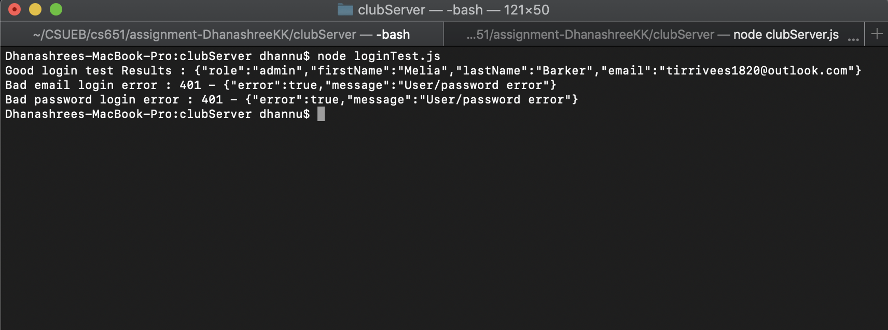

# Homework #8 Solution
**Student Name**:  Dhanashree Kamath Kasaragod

**NetID**: hs4947

## Question 1
### (a)
``` hashUsers.js
const fs = require('fs');
const bcrypt = require('bcryptjs');
const users = require('./clubUsers2.json');
let nRounds = 13;
let hashedUsers = [];
let start = new Date();// timing code
console.log(`Starting password hashing with nRounds = ${nRounds}, ${start}`);

//code here to process the passwords
users.map(user=> {

let salt = bcrypt.genSaltSync(nRounds);// New salt everytime!
let passHash = bcrypt.hashSync(user.password, salt);
let newDict = {"firstName":user.firstName,"lastName":user.lastName,"email":user.email,"passHash":passHash,"role":user.role};
hashedUsers.push(newDict);
});

let elapsed = new Date() - start;//timing code
console.log(`Finished password hashing, ${elapsed/1000} seconds.`);
fs.writeFileSync("clubUsersHash.json", JSON.stringify(hashedUsers, null, 2));
```  
Few entries to of the clubUsersHash.json
``` Json
[
  {
    "firstName": "Melia",
    "lastName": "Barker",
    "email": "tirrivees1820@outlook.com",
    "passHash": "$2a$13$f/ihY43nzTMuSrEaGJhSuuI0wUhQDrenjvoBNN3WjlUtaoLlVn6oS",
    "role": "admin"
  },
  {
    "firstName": "Demetrice",
    "lastName": "Parker",
    "email": "chihuahua1899@gmail.com",
    "passHash": "$2a$13$N5lekEZjJ0lFSHm5HsEgYudCFDDWmryj.zp7Ebrbsnxq17yPuhX3u",
    "role": "member"
  },
  ... .... 
  ... ... 
]
```

### (b)


## Question 2 

### (a)
Addition of login interface to the server
``` javascript
app.post('/login', express.json(), function(req, res) {
 
    let email = req.body.email; 
    let password = req.body.password;

    //Find user in json by comparing email
    let user = users.find(function(user){
       return user.email === email;
    });
    
    if(!user){
       res.status(401).json ({error:true, message:"User/password error"});
       return;
    }

    //Match password using bcrypt
    let verified = bcrypt.compareSync(password, user.passHash)
     if(verified) {
       let newUserInfo = {"firstName":user.firstName,"lastName":user.lastName,"email":user.email,"role":user.role};
       console.log(`path /addThing received: ${JSON.stringify(req.body)}`);
       res.json(newUserInfo);
     }
     else{
         res.status(401).json ({error:true, message:"User/password error"});
       return;
     } 

  });
```
### (b)


## Question 3

### (a)   
``` javascript
//Server intialization of session
const cookieName = "hs4947Clubsid"; // Session ID cookie name, use this to delete cookies too.
app.use(session({
    secret: 'club website development',
    resave: false,
    saveUninitialized: false,
    name: cookieName // Sets the name of the cookie used by the session middleware
}));
// This initializes session state
const setUpSessionMiddleware = function (req, res, next) {
    console.log(`session object: ${JSON.stringify(req.session)}`);
    console.log(`session id: ${req.session.id}`);
    if (!req.session.user) {
        req.session.user = {role: "guest"};
    };
    next();
};

app.use(setUpSessionMiddleware);
```

### (b)


### (c)
Updated login code :
``` javascript
app.post('/login', express.json(), function(req, res) {
 
    let email = req.body.email; 
    let password = req.body.password;

    //Find user in json by comparing email
    let user = users.find(function(user){
       return user.email === email;
    });
    
    if(!user){
       res.status(401).json ({error:true, message:"User/password error"});
       return;
    }

    //Match password using bcrypt
    let verified = bcrypt.compareSync(password, user.passHash)
     if(verified) {

       let oldInfo = req.session.user;
        req.session.regenerate(function (err) {
            if (err) {console.log(err);}
            let newUserInfo = Object.assign(oldInfo, user);
            delete newUserInfo.passHash;
            req.session.user = newUserInfo;
            res.json(newUserInfo);
        });
       // let newUserInfo = {"firstName":user.firstName,"lastName":user.lastName,"email":user.email,"role":user.role};
       // console.log(`path /addThing received: ${JSON.stringify(req.body)}`);
       // res.json(newUserInfo);
     }
     else{
         res.status(401).json ({error:true, message:"User/password error"});
       return;
     } 

  });
```
### (d)


### (e)
Updated LoginTest code:
``` loginTest.js
async function tests()
{
    //Test 1 check 1)call activities 2) call post good login (correct email, password), 3) logout.........
    try {
        //...........call activities........
        console.log("Login Test 1: GoodLogin");
        let res = await rp(getActivities);
        console.log(`Called Activities ,Cookies: ${cookiejar.getCookieString(getActivities.url)}`);
    }
    catch (e) {
        console.log(e);
    }

    //Call to check good email and password
    try {
        //...........good login........
        let res = await rp(postGoodEmailPass);
        console.log("Good login test Results :",JSON.stringify(res));
        console.log(`After Good Login ,Cookies: ${cookiejar.getCookieString(postGoodEmailPass.url)}`);
    }
    catch (e) {
        console.log(e);
    }
    //Logout call
    try {
        //...........log out........
        let res = await rp(logoutCall);
        //console.log("Good login test Results :",JSON.stringify(res));
        console.log(`After Logout ,Cookies: ${cookiejar.getCookieString(logoutCall.url)}`);
    }
    catch (e) {
        console.log(e);
    }
    //Test 2 check 1)call activities 2) call post bad login (incorrect email, password)....
    try {
        //...........call activities........
        console.log("Login Test 2: Bad Email");
        let res = await rp(getActivities);
        console.log(`Called Activities ,Cookies: ${cookiejar.getCookieString(getActivities.url)}`);
    }
    catch (e) {
        console.log(e);
    }
    //Call to check bad email and password
    try {
        //...........bad login with bad email........
        let res = await rp(postBadEmailIncorrectPass);
    }
    catch (e) {
       console.log("Bad email login error :",e.message);
       console.log(`After Login Test 2 ,Cookies: ${cookiejar.getCookieString(postBadEmailIncorrectPass.url)}`);
   }
   
     //Test 3 check 1) call post bad login (correct email, incorrectpassword)........
     //Call to check good email and incorrect password
     try {
        //...........call activities........
        console.log("Login Test 3: Bad Password");
        let res = await rp(getActivities);
        console.log(`Called Activities ,Cookies: ${cookiejar.getCookieString(getActivities.url)}`);
    }
    catch (e) {
        console.log(e);
    }
     try {
        let res = await rp(postGoodEmailIncorrectPass);
    }
    catch (e) {
        console.log("Bad password login error :",e.message);
        console.log(`After Login Test 3 ,Cookies: ${cookiejar.getCookieString(postGoodEmailIncorrectPass.url)}`);
    }
}

```


## Question 4

### (a)


### (b)


### (d)


## Question 5

### (a)


### (b)


